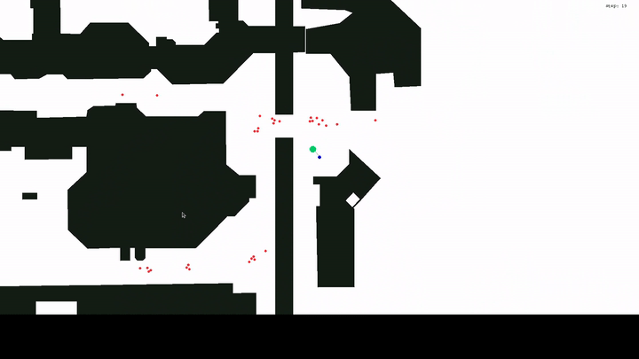

# robot-sf

## About
This project provides a training environment for the simulation of a robot moving
in a pedestrian-filled space.

The project interfaces with OpenAI Gym to facilitate trainings with various
SOTA reinforcement learning algorithms like e.g. StableBaselines3.
For simulating the pedestrians, the SocialForce model is used via a dependency
on a fork of PySocialForce.

Following video outlines some training results where a robot with e-scooter
kinematics is driving at the campus of University of Augsburg using real
map data from OpenStreetMap.



## Quickstart

### 1. Clone Source Code

```sh
git clone --recurse-submodules https://github.com/Bonifatius94/robot-sf
cd robot-sf
```

### 2. Install Dependencies

```sh
python3 -m pip install pip --upgrade
python3 -m pip install -r requirements.txt
python3 -m pip install -r fast-pysf/requirements.txt
```

### 3. Register *robot_sf* and *pysocialforce* Packages

```sh
pushd ./fast-pysf
    python3 -m pip install .
popd
python3 -m pip install .
```

*Note: This needs to be repeated to propagate robot_sf changes on a host deployment.
Otherwise the calling scope might run an old version of robot_sf.
Dockerized deployments will recognize when a change requires a rebuild.*

Alternatively create soft links for fast-pysf. The modules and tests are
automatically detected by the interpreter if the calling scope is located
at the repository's root directory which is very useful e.g. for debugging.

```sh
ln -s fast-pysf/pysocialforce pysocialforce
pushd tests
    ln -s ../fast-pysf/tests pysf_tests
popd
```

*Note: The outlined command might differ on Windows, e.g. try mklink*

### 4. Run Linter / Tests

```sh
python3 -m pytest tests
python3 -m pylint robot_sf
```

### 5. Run Visual Debugging of Pre-Trained Demo Models

```sh
python3 demo_offensive.py
python3 demo_defensive.py
```

### 6. Run StableBaselines Training (Docker)

```sh
docker-compose build && docker-compose run \
    robotsf-cuda python ./scripts/training_ppo.py
```

*Note: See [this setup](./docs/GPU_SETUP.md) to install Docker with GPU support.*

### 7. Edit Maps

```sh
sudo apt-get update && sudo apt-get install -y python3-tk
```

```sh
python3 -m map_editor
```

*Note: See [this documentation](./docs/MAP_EDITOR_USAGE.md) on how to use the map editor.*

### 8. Optimize Training Hyperparams (Docker)

```sh
docker-compose build && docker-compose run \
    robotsf-cuda python ./scripts/hparam_opt.py
```
