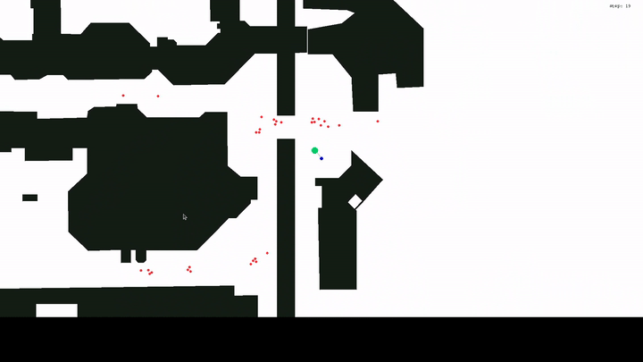

# Robot SF

[](https://github.com/ll7/robot_sf_ll7/actions/workflows/ci.yml?query=branch%3Amain)
[](LICENSE)
[](pyproject.toml)
[](https://doi.org/10.5281/zenodo.19563812)

Gymnasium-based social navigation simulation and benchmarking for a robot moving through
pedestrian-filled environments.

> **Status:** Active development. Start here for a quick first touch, then use the linked docs for
> detailed workflows, benchmarks, and contributor guidance.



## Start here

| I want to... | Go to |
| --- | --- |
| Understand the project quickly | [Why Robot SF?](#why-robot-sf) |
| Install dependencies and run the first demos | [Quickstart](#quickstart) |
| Browse runnable examples | [`examples/README.md`](examples/README.md) |
| Find architecture, benchmark, and workflow docs | [`docs/README.md`](docs/README.md) |
| Follow the contributor workflow | [`docs/dev_guide.md`](docs/dev_guide.md) |
| Review repository conventions for agents and contributors | [`AGENTS.md`](AGENTS.md) |
| See the public Zenodo-backed release artifact | [DOI 10.5281/zenodo.19563812](https://doi.org/10.5281/zenodo.19563812) |
| Trace upstream lineage and citations | [`ACKNOWLEDGMENTS.md`](ACKNOWLEDGMENTS.md) |

## Why Robot SF?

- **Factory-based environments:** reusable Gymnasium entry points for robot and pedestrian
  simulations.
- **Curated examples:** quickstart, advanced, benchmark, and plotting workflows live in
  [`examples/README.md`](examples/README.md).
- **Benchmark-oriented tooling:** reproducible evaluation, metrics aggregation, and analysis docs are
  indexed in [`docs/README.md`](docs/README.md).
- **Repo-native contributor workflow:** setup, validation, and shared `scripts/dev/` entry points
  are documented in [`docs/dev_guide.md`](docs/dev_guide.md).

## Quickstart

The repository uses `uv` for dependency management and keeps generated artifacts under the
git-ignored `output/` directory.

```bash
git clone https://github.com/ll7/robot_sf_ll7
cd robot_sf_ll7

scripts/dev/check_runtime_requirements.sh
uv sync --all-extras

uv run python examples/quickstart/01_basic_robot.py
uv run python examples/quickstart/02_trained_model.py
uv run python examples/quickstart/03_custom_map.py
```

### Packaging smoke (wheel install smoke)

To validate a wheel install path in a clean environment:

```bash
uv build
scripts/validation/wheel_install_smoke.sh
```

The smoke installs the built wheel into a temporary venv, then verifies a minimal import
with a small bootstrap dependency set (`loguru`, `numba`, `matplotlib`). This is a
`clean install + import` guardrail, not a full runtime benchmark install.

Training and experiment tooling is optional for core imports. Install it explicitly when
running PPO/SB3, Optuna, TensorBoard, or W&B workflows:

```bash
uv sync --extra training
```

CARLA is not installed by `uv sync --all-extras`. On CARLA-capable Linux x86_64 hosts, opt into
the pinned host-side client with `uv sync --all-extras --group carla` and check the Docker runtime
with `scripts/dev/check_carla_runtime.sh`.

These three scripts provide the fastest first-touch path:

1. `01_basic_robot.py` introduces the environment factory and a headless rollout.
2. `02_trained_model.py` replays the bundled PPO benchmark example.
3. `03_custom_map.py` shows how to load and simulate a custom SVG map.

For host packages, optional capabilities, and a fuller setup walkthrough, see
[`docs/dev_guide.md`](docs/dev_guide.md) and [`docs/dev_runtime_requirements.md`](docs/dev_runtime_requirements.md).

## Where to go next

- **Examples:** [`examples/README.md`](examples/README.md) organizes the quickstart path plus
  advanced features, benchmark runners, and plotting utilities.
- **Documentation index:** [`docs/README.md`](docs/README.md) is the central map for architecture,
  benchmarking, training, analysis, and context notes.
- **Benchmark and artifact context:** the public release artifact is published at
  [10.5281/zenodo.19563812](https://doi.org/10.5281/zenodo.19563812). For benchmark-specific
  semantics and caveats, follow the benchmark docs linked from `docs/README.md`.

## Development workflow

Use the development guide as the source of truth for contributor commands. The common local flow is:

```bash
uv run pre-commit install
scripts/dev/ruff_fix_format.sh
scripts/dev/run_tests_parallel.sh
BASE_REF=origin/main scripts/dev/pr_ready_check.sh
```

If you are contributing through an agent workflow or want the repository-specific automation rules,
start with [`AGENTS.md`](AGENTS.md).

## Acknowledgments and provenance

The root README stays intentionally short. Upstream lineage, cited papers, and related repositories
are preserved in [`ACKNOWLEDGMENTS.md`](ACKNOWLEDGMENTS.md).
