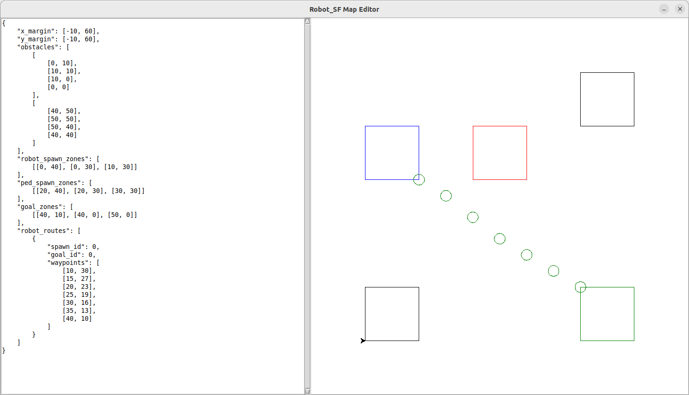

# robot-sf

## Map Editor

### About
The map editor module supports assembling maps for the robot_sf simulator
through a graphical interface. It comes as a split-screen design
containing a text editor to the left and a map preview window to the right.



### Map File Format
Following sections outline the different parts of a valid map file.

#### X / Y Margin
The x / y coordinate space bounds have to be specified through margins,
both properties are mandatory.

The ``x_margin`` property specifies the x coordinate space as [``min_x``, ``max_x``].
Same goes for ``y_margin`` spanning the y coordinate space between [``min_y``, ``max_y``].
Both space bounds are continuous floating-point numbers.

```json
{
    "x_margin": [-10, 60],
    "y_margin": [-10, 60],
    ...
}
```

#### Spawn and Goal Zones
The random sampling of spawn and goal positions of the robot and all pedestrians
is specified through rectangular zones.
Each rectangle with points ABCD is given as a tuple of (A, B, C) where |AC|
represents the diagonal; D = A + (C - B).

The spawn zones are defined as ``robot_spawn_zones`` and ``ped_spawn_zones``
and the goal zones as ``goal_zones``. All three properties are mandatory
and need to contain at least one zone each.

```json
{
    "robot_spawn_zones": [
        [[0, 40], [0, 30], [10, 30]]
    ],
    "ped_spawn_zones": [
        [[20, 40], [20, 30], [30, 30]]
    ],
    "goal_zones": [
        [[40, 10], [40, 0], [50, 0]]
    ],
    ...
```

In the map editor's preview window, robot spawn zones are blue,
pedestrian spawn zones are red and goal zones are green.
The colors are coherent with the simulation view's coloring.

#### Robot Routes
For navigating the robot from each spawn zone towards each goal zone,
routes have to be specified. Each route contains a list of waypoints
which are used by the simulator to mock global navigation.

The routes are specified by the ``robot_routes`` property.
It's always required to contain all combinations of robot spawn zones
and goal zones where the route waypoints are a non-empty list.

Spawn and goal zones with n elements are assigned ids within [0, n-1]
in an ascending order according to their position in the map file.

```json
{
    "robot_spawn_zones": [
        [[0, 40], [0, 30], [10, 30]]
    ],
    "goal_zones": [
        [[40, 10], [40, 0], [50, 0]]
    ],
    "robot_routes": [
        {
            "spawn_id": 0,
            "goal_id": 0,
            "waypoints": [
                [10, 30],
                [15, 27],
                [20, 23],
                [25, 19],
                [30, 16],
                [35, 13],
                [40, 10]
            ]
        }
    ],
    ...
}
```

In the map editor, routes are displayed as green circles.

#### Obstacles
Last but not least, the map contains a set of obstacles that the robot
and the pedestrians need to navigate around to avoid collisions.

The obstacles are specified as ```obstacles``` property. It contains
a list of polygon where each polygon consists of a list of vertices.
The obstacles list is allowed to be empty, although it doesn't make
a lot of sense to have an empty map.

```json
{
"obstacles": [
        [
            [0, 10],
            [10, 10],
            [10, 0],
            [0, 0]
        ],
        [
            [40, 50],
            [50, 50],
            [50, 40],
            [40, 40]
        ]
    ],
    ...
}
```

Obstacles are displayed with black lines which is consistent with
the simulation's coloring.

### Known Issues
- The text editor doesn't support the Ctrl+A key binding to select all text.
