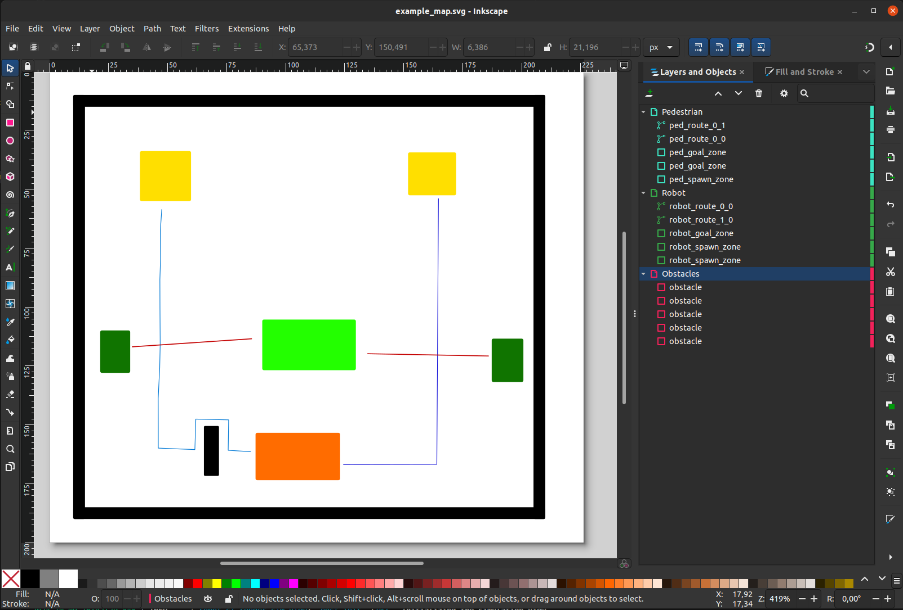

# robot-sf

## SVG Map Editor

### About

This file explains how to build a map for robot-sf using a svg-editor.
All examples are made with [inkscape](https://inkscape.org/).


### Setup

These settings should be checked before building a map.

- Use **px** as global unit (File -> Document Properties)

- Use absolute coordinates for your path, marked by the **M**.\
(Edit -> Preferences -> Input/Output -> SVG Output -> Path string format -> Absolute)

*Inkscape version: 1.3.2*

[Further reference](https://github.com/ll7/robot_sf_ll7/issues/40)

### Quick Start (Template)

To avoid common labeling mistakes, start from the Inkscape template:

```bash
cp maps/templates/map_template.svg maps/svg_maps/my_map.svg
```

Open `maps/svg_maps/my_map.svg` in Inkscape and edit/duplicate/delete elements as needed.
All simulation-relevant SVG elements must have the exact `inkscape:label` values described below.

### Building the map

Colours can be selected as desired, as the simulation uses its own colour scheme.
However, it is best to remain consistent to make the map easier to understand.

The most important part is setting the label. In Inkscape this can be done by double-clicking the object in the layers-and-objects list on the right side or by right-clicking the object and selecting the object properties.

Use layers to make it clearer.

#### Obstacles

Obstacles should be avoided by the vehicle and the pedestrians.\
Draw them by using the rectangle tool.\
Set the label to **obstacle** (exactly; do not add suffixes like `_0`).

[Obstacle Issue](https://github.com/ll7/robot_sf_ll7/issues/55)

#### Robot

The robot needs a spawn zone to define his starting position and a goal zone he needs to reach to finish the episode.\
Multiple zones can be used.\
Draw them by using the rectangle tool.\
Set the labels to **robot_spawn_zone** and **robot_goal_zone**

The robot path defines the route the robot takes, while reaching the goal zone.\
Use the pen tool for this and perform multiple left clicks to set waypoints along the path.\
The path should not start or end inside the spawn/goal zone, but just before it.\
Set the label to **robot_route_\<spawn\>_\<goal\>**

(e.g. robot_route_1_0 -> Using Spawn 1 and Goal 0.\
The zone numbers are counted from bottom to top in the list on the right-hand side)

#### NPC Pedestrians

The Pedestrians also need a spawn/goal zone. If they reach the goal they will spawn again at the start\
Set the labels to **ped_spawn_zone** and **ped_goal_zone**

For the path you don't need to set specific waypoints, just make sure the path doesn't collide with an obstacle.\
Set the label to **ped_route_\<spawn\>_\<goal\>**

Optionally, you can add crowded zones (areas with higher pedestrian density) as rectangles labeled
**ped_crowded_zone**.

#### POIs (Points of Interest)

POIs are circles that can be used as named waypoints (e.g., for routing demos).

- Create a **circle** element (not an ellipse; hold Ctrl while drawing to keep it a circle).
- Set the circle **class** to `poi`.
- Set the `inkscape:label` to the desired POI name (e.g., `kitchen`, `charging`).

#### Single Pedestrians (Optional)

To define individually controlled pedestrians, use circles labeled:

- `single_ped_<id>_start`
- `single_ped_<id>_goal` (optional)

### Colours

Colours used in the example map:

- obstacle: #000000
- robot_spawn_zone: #ffdf00
- robot_goal_zone: #ff6c00
- robot_route: #0300d5 and #0078d5
- ped_spawn_zone: #23ff00
- ped_goal_zone: #107400
- ped_route: #c40202
- ped_crowded_zone: #b3b3b3
- poi: #8c4bff

The colours for the simulation can be found here: [sim_view.py](../robot_sf/render/sim_view.py)

### Validating Your Map

After creating or modifying a map, you can validate it using the map verification tool. This ensures your map is structurally sound and compatible with the simulation.

#### Running the Verifier

Validate a specific map:
```bash
python scripts/validation/verify_maps.py --scope your_map.svg --mode local
```

Validate all maps:
```bash
python scripts/validation/verify_maps.py --scope all --mode local
```

Validate with structured output:
```bash
python scripts/validation/verify_maps.py --scope all --output output/validation/map_verification.json
```

#### What Gets Checked

The verifier performs the following checks:
- **File Readability**: Ensures the SVG file exists and is accessible
- **Valid SVG**: Validates XML/SVG syntax
- **File Size**: Warns if map exceeds 5 MB (may impact performance)
- **Layer Organization**: Recommends using Inkscape labels for better organization

#### Interpreting Results

- **✓ PASS**: All checks passed - map is ready to use
- **✗ WARN**: Map works but has non-critical issues (e.g., missing labels)
- **✗ FAIL**: Map has critical issues that must be fixed

For detailed information about the verification workflow, see [specs/001-map-verification/quickstart.md](../specs/001-map-verification/quickstart.md).

### OSM-Based Map Extraction (Alternative Approach)

For a **programmatic, reproducible, and offline** alternative to manual SVG editing, Robot SF now supports **OpenStreetMap (OSM) data import**. This approach automatically extracts map geometry, renders backgrounds, and defines zones—all without requiring manual Inkscape edits.

#### Quick Comparison

| Approach | Effort | Reproducibility | Offline | Semantic Data |
|----------|--------|---|---------|---|
| **Manual SVG Editor** | High (manual) | Moderate (requires re-editing) | ✓ Yes | Limited to labels |
| **OSM Extraction** | Low (code) | ✓ Excellent (deterministic) | ✓ Yes (after download) | ✓ Rich (tags, types) |

#### When to Use OSM Extraction

✓ **Use OSM extraction if**:
- You need **reproducible scenarios** (same code → same geometry)
- You work with **real-world maps** (cities, campus layouts)
- You want **fast iteration** (edit code, not GUI)
- You need **semantic data** (zone types, density levels)

✓ **Use manual editor if**:
- You need custom artistic layouts
- You want quick one-off maps
- You prefer visual feedback while editing

#### Getting Started with OSM

For a complete workflow guide—including PBF acquisition, map extraction, zone definition, and examples—see:

**[📖 Complete OSM Workflow Guide](./osm_map_workflow.md)**

Key resources:
- **Quick Start** (3 options: editor, programmatic, hybrid)
- **Detailed Workflow** (6 steps with code examples)
- **Programmatic API** (6 helper functions for zone/route creation)
- **Troubleshooting** (10+ common issues + fixes)
- **Real-world Examples** (4 working scenarios)

#### Programmatic API Preview

```python
from robot_sf.maps.osm_zones_config import create_spawn_zone, create_goal_zone, create_route

# Define zones in code (no GUI needed)
spawn = create_spawn_zone("robot_start", polygon=[(0, 0), (10, 0), (10, 10)])
goal = create_goal_zone("target", polygon=[(50, 50), (60, 50), (60, 60)])
route = create_route("main_path", waypoints=[(10, 10), (50, 50)])

# Save to YAML (deterministic, versionable)
from robot_sf.maps.osm_zones_yaml import save_zones_yaml
config = create_config_with_zones_routes([spawn, goal], [route])
save_zones_yaml(config, "scenario.yaml")
```

#### Features

- **Semantic Zone Creation**: Spawn zones, goal zones, pedestrian density zones, routes
- **Deterministic Output**: Same code → byte-identical YAML (fully reproducible)
- **Round-trip Compatibility**: Programmatic ≡ editor (can mix and match workflows)
- **Full Documentation**: API reference, troubleshooting, 5+ examples
- **Backward Compatible**: Works alongside existing SVG maps

#### Next Steps

1. **Quick Start** (10 min): See [osm_map_workflow.md: Quick Start](./osm_map_workflow.md#quick-start)
2. **Detailed Workflow** (30 min): Follow [osm_map_workflow.md: Detailed Workflow](./osm_map_workflow.md#detailed-workflow)
3. **Example Scenarios** (15 min): Run `examples/osm_programmatic_scenario.py`

---

### New Features

If you want to implement new features: [svg_map_parser.py](../robot_sf/nav/svg_map_parser.py)


### Example: Handling Lakes in OSM Exports

This workflow shows how to include a lake as an obstacle when working with OSM-based exports such as `maps/osm_svg_maps/uni_campus_1350.svg`.

1. Export the SVG from the OSM website and keep the scale factor in the filename (e.g., `_1350`) so downstream tools can reuse it. If you only need buildings, run `examples/example_osm_svg_to_obstacle_svg.py` on the export. The script filters elements by the building color string and applies the scale factor to produce a building-only SVG.
2. The lake in this example does not share the building color, so it is skipped as an obstacle. To include it, open the OSM SVG in Inkscape (or edit the XML directly), locate the lake path, and change its color to exactly match the building color string. Reading the color value from the SVG source and pasting it into the lake’s style can be faster than using the GUI.
3. After recoloring, the lake becomes one large obstacle with no crossings. To create crossings, split the shape: use the **Eraser** tool to cut the lake where crossings should exist (it will still be a single path), then use the **Shape Builder** tool to click each desired section and confirm to turn the pieces into separate objects.
4. Select each new lake section, open **Object Properties**, set the **Label** to `obstacle`, and click **Set** so the parser treats every piece as an obstacle.
5. Save the updated SVG. You now have a lake represented as multiple obstacle objects that allow crossings where you split the shape.
