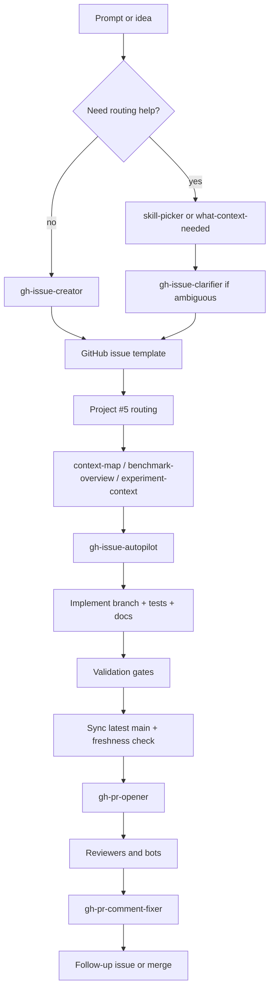

# AI Coding Workflow

[Back to Documentation Index](../README.md)

This note describes the current end-to-end AI-assisted workflow in `robot_sf_ll7`.
It is the repo-native path from a rough prompt to a tracked issue, an implemented branch,
validation, PR review, and follow-up cleanup.

## What This Workflow Optimizes For

- Research progress first, with proof and process proportional to the risk of the claim.
- Markdown-first traceability for decisions, context, and handoffs.
- Config-first reproducibility for training and benchmark runs.
- Conservative validation before PR creation for benchmark, schema, metric, and paper-facing work.
- One canonical instruction tree for all supported coding-agent runtimes.
- Follow-up issues instead of hidden scope creep.

## Canonical Surfaces

Read these first when working in this workflow:

- [AGENTS.md](../../AGENTS.md)
- [docs/maintainer_values.md](../maintainer_values.md)
- [docs/dev_guide.md](../dev_guide.md)
- [docs/README.md](../README.md)
- [docs/ai/repo_overview.md](repo_overview.md)
- [docs/ai/agent_workflow_entrypoints.md](agent_workflow_entrypoints.md)
- [docs/context/README.md](../context/README.md)
- [docs/context/issue_713_batch_first_issue_workflow.md](../context/issue_713_batch_first_issue_workflow.md)
- [docs/context/issue_728_coding_agents_compatibility.md](../context/issue_728_coding_agents_compatibility.md)
- [docs/context/pr_first_pass_review_audit_2026-05-14.md](../context/pr_first_pass_review_audit_2026-05-14.md)
- [docs/project_prioritization.md](../project_prioritization.md)
- [docs/dev/training_protocol_template.md](../dev/training_protocol_template.md)
- [docs/context/issue_691_benchmark_fallback_policy.md](../context/issue_691_benchmark_fallback_policy.md)
- [memory/MEMORY.md](../../memory/MEMORY.md)
- [.agents/skills/README.md](../../.agents/skills/README.md)

## End-To-End Flow

### 1. Route the request

Use the smallest useful routing skill first:

- `skill-picker` when the right workflow is unclear.
- `what-context-needed` when the prompt is underspecified.
- `gh-issue-clarifier` when an issue needs scope tightening or decision options.
- `benchmark-overview` or `experiment-context` for benchmark, planner, or training work.
- `quality-playbook` for non-trivial work that needs risk-proportional validation planning.

The goal is to avoid jumping directly into edits before the problem, scope, and validation path are
clear. Do not use this as a reason to block exploratory work; label uncertainty clearly and keep
moving when the risk is low.

### 2. Create or repair the issue

Use `gh-issue-creator` to turn the request into a repo-ready issue.

Pick the narrowest GitHub issue template that fits the task:

- `research-validation.yml` for bounded research questions with explicit evidence grade,
  artifact policy, and validation command.
- `test-debt.yml` for skipped, failing, flaky, weak, or missing tests.
- `blocked-external-artifact.yml` for unavailable datasets, models, runtimes, licenses, or
  artifact pointers.
- `execution-run.yml` for long local, SLURM, or release executions with current phase and next
  decision point.
- `epic.yml` for parent issues that need child links or a child-creation task.
- `issue_default.md` for mixed or vague requests.
- `documentation.md` for guides and workflow docs.
- `benchmark_experiment.md` for benchmark or scenario work.
- `enhancement.md`, `refactor.md`, `research.md`, or `planner_integration.md` when the task clearly fits one of those shapes.

Keep the issue body explicit about:

- goal or problem,
- scope and out-of-scope items,
- added value,
- effort and complexity,
- risk,
- affected files,
- definition of done,
- success metrics,
- validation and testing,
- estimate discussion,
- project metadata.

If the issue is ambiguous, do not guess. Clarify the open questions first and keep the scope narrow.

### 3. Route GitHub issue metadata

Use GitHub MCP or the `gh` CLI depending on which is most reliable for the current step.

For batches of issues:

1. Clean up issue text, labels, and comments first.
2. Route Project #5 metadata second.
3. Run derived score sync last, once per batch.

Use REST-backed `gh api repos/...` calls for ordinary issue/PR/label/comment operations and local
`git` for repository state. Reserve GraphQL for Projects v2, review-thread operations, and nested
queries that are genuinely cheaper. If GraphQL quota is low, finish issue cleanup through REST and
leave Project #5 mutations as explicit pending work rather than retry-looping.
During long delegated runs, record the REST publication path that actually worked: PR create,
head-SHA check-run polling, labels, merge, closeout comment, and cleanup. A successful REST
operation is publication evidence only; still verify branch head, CI state, and local validation
before applying merge-ready or calling an issue closed.

The priority workflow uses [docs/project_prioritization.md](../project_prioritization.md) as an
advisory rubric, not as hard authority over current maintainer direction or fresh evidence.
The fields to review are:

- Improvement
- Success Probability
- Time Criticality
- Unlock Factor
- Expected Duration in Hours
- Priority Score

Set values conservatively and only write them back after a plausibility check.

### 4. Gather context and plan

Use the context and planning skills to avoid broad or unfocused edits:

- `context-map` for multi-file discovery.
- `benchmark-overview` for benchmark semantics and artifact surfaces.
- `experiment-context` for config-first training and evaluation paths.
- `review-and-refactor` for a narrow review-then-edit pass.
- `update-docs-on-code-change` whenever code changes would stale docs.
- `context-note-maintainer` when the work produces durable reasoning or validation notes.

For training and evaluation work, the config is part of the traceability record. Commit the config,
record the protocol, and keep the run reproducible through a versioned YAML surface and a docs note.

### 5. Implement the issue

Use `gh-issue-autopilot` when the goal is to take an issue from intake to implementation.

The expected implementation loop is:

1. Inspect the issue and linked context.
2. Create or switch to a branch.
3. Make the smallest change that satisfies the scope.
4. Add or update tests and docs as part of the same change.
5. Split deferred work into follow-up issues.

Do not expand scope silently. If the issue grows, stop and split the extra work into a follow-up issue.

### 6. Validate before PR creation

Use the repository gates before higher-risk PRs are opened:

- `scripts/dev/ruff_fix_format.sh`
- `scripts/dev/run_tests_parallel.sh`
- `BASE_REF=origin/main scripts/dev/pr_ready_check.sh`
- `PR_READY_MODE=final BASE_REF=origin/main scripts/dev/pr_ready_check.sh`

The standard readiness flow is fail-fast and failed-first by default. Use the plain command for
interim feedback while the tree may still be dirty. Use `PR_READY_MODE=final` before PR handoff;
it fails instead of recording final readiness when non-ignored files are uncommitted. If a failure
appears, assess test value first before changing or removing tests.

For docs-only and low-risk instruction branches, use the cheaper official path by default: inspect
the diff, verify referenced paths where practical, and state in the PR when the full readiness gate
was skipped. Do not use the cheap path for benchmark, metric, schema, model-provenance, runtime, or
paper-facing changes.

The PR readiness gate also checks:

- changed-files coverage, with an 80 percent minimum by default,
- touched-definition docstring TODO warnings,
- full test execution through the shared parallel wrapper.

For benchmark-sensitive changes, use the canonical benchmark command or smoke path and treat fallback or degraded execution as diagnostic only, not as success.

Before opening the PR, also run a first-pass self-review against the current diff using
[docs/context/pr_first_pass_review_audit_2026-05-14.md](../context/pr_first_pass_review_audit_2026-05-14.md).
Treat it as a reviewer-lens pass, not another full test suite:

- For docs/proof-heavy branches, run
  `BASE_REF=origin/main scripts/dev/check_docs_proof_consistency_diff.sh` before PR creation to
  catch high-confidence context/evidence drift such as missing context-note index links, absolute
  local paths in tracked evidence, and durable evidence files that still point at ignored
  `output/` artifacts.
- docs/context changes: align PR-body validation, context-note validation, and exact proof output;
  add required `docs/README.md` and `docs/context/README.md` links.
- schema, parser, path, JSON, artifact, and public-helper changes: check malformed payloads,
  missing values, wrong shapes, directories, absolute paths, traversal, `NaN`, `inf`, and negative
  sentinels.
- simulation-loop, recording, benchmark, or environment changes: check streaming behavior,
  random-state isolation, static Gymnasium spaces, and per-step output size.
- skill or agent workflow changes: read changed text as executable instructions and preserve
  selected issue sets, scope boundaries, and evidence destinations.
- reusable agent workflow lessons: use `agent-workflow-capture` to write private candidates under
  `.git/codex-agent-runs/notes/inbox/`; use `agent-workflow-promotion` only when evidence supports
  a small durable repo change. Do not promote private logs, local paths, or weak observations, and
  do not relax benchmark or paper-facing proof rules.
- delegated worker outputs: record useful sidecar answers as `route_evidence`, not benchmark or
  claim proof by themselves. Classify missing or sparse compact artifacts as route failure or T0
  evidence. If the worker produced no useful `result`, `status`, or `diffstat` summary, rely on
  local validation or reroute instead of treating the silence as a negative finding. Routed-worker
  manifests should include per-attempt artifact presence for `result.json`, `RESULT.md`,
  `diffstat.txt`, `status.txt`, and `validation.txt`; wrapper success, zero exit, and manifest
  presence are still route evidence only, not task acceptance.

### 7. Open the PR

Use `gh-pr-opener` after the branch has been synced with the latest `origin/main`. For higher-risk
branches, the readiness stamp must be fresh; for docs-only or low-risk branches using the cheap
path, the PR must clearly list the skipped gate.

The PR body should come from `.github/PULL_REQUEST_TEMPLATE/pr_default.md` and keep the template sections intact.

PR creation should only happen after the branch diff shows the issue scope is actually implemented.

### 8. Review and fix comments

Automated and online reviewers may include:

- CodeRabbit,
- Gemini,
- Codex,
- Copilot.

Treat these tools as reviewers, not as the source of truth. The source of truth is still the repo-native code, docs, tests, and validation commands.

When comments arrive, use `gh-pr-comment-fixer` or the equivalent local edit flow:

1. Read the comment and decide whether it is actionable.
2. Make the smallest justified fix.
3. Re-run validation.
4. Push the fix.
5. Resolve the review thread only after the fix is landed.

GitHub treats a reply and a resolution as separate actions. A reply such as "fixed in
`<commit>`" leaves the conversation unresolved until the review-thread id is passed to the
GraphQL `resolveReviewThread` mutation. Resolve fixed threads with:

```bash
gh api graphql \
  -F thread_id=<review_thread_id> \
  -f query='mutation($thread_id:ID!){resolveReviewThread(input:{threadId:$thread_id}){thread{id isResolved}}}'
```

Then re-query the PR's `reviewThreads` and verify that addressed threads report
`isResolved: true`. If GraphQL auth, rate limits, or permissions prevent resolution, say that the
fix was pushed but the named thread ids remain unresolved.

### 9. Close the loop

When work is deferred, create a follow-up issue rather than leaving the remainder hidden in chat or PR text.
The cost of an issue is low; prefer one central collection system with better filtering over
separate backlog stores.

Keep the parent issue open until the branch is ready for merge or the repository process says otherwise.

Every relevant substantial step should leave a durable Markdown trace in either `docs/context/` or
`memory/`:

- use `docs/context/` for issue history, execution notes, and validation evidence, while keeping it
  indexed and pruned rather than treating it as a bulk scratchpad,
- use `memory/` for stable cross-session facts that will be reused later.

The broader `docs/context/` retrieval-architecture redesign is tracked in GitHub issue #1714.
Priority-discussion workflow follow-up is tracked in GitHub issue #1729, and stale Claude
compatibility cleanup is tracked in GitHub issue #1728.

## Cross-Agent Compatibility

Robot SF keeps one canonical instruction tree and mirrors it to the supported agent runtimes.

- `.agents/` is the source of truth.
- `.codex/`, `.opencode/`, `.github/`, and `.gemini/` are compatibility surfaces.
- When needed, `scripts/tools/sync_ai_config.py` checks or repairs the symlinked mirrors.

The goal is not to maintain separate rule sets for different agents. The goal is to keep one
instruction source and expose it through the supported entry points.

## Benchmark And Training Traceability

For benchmark and training work, keep these rules in mind:

- use committed configs as the primary execution contract,
- document the run in a Markdown note,
- keep the artifact root under `output/`,
- record the command path that produced the result,
- do not count fallback or degraded behavior as a successful benchmark outcome unless the fallback itself is the subject of the note.

The repository already treats Markdown as the backbone of durable documentation, so training notes,
benchmark notes, issue notes, and PR text should reinforce the same traceability chain instead of inventing a second one.

## Mermaid Overview



## Practical Default Commands

```bash
scripts/dev/ruff_fix_format.sh
scripts/dev/run_tests_parallel.sh
BASE_REF=origin/main scripts/dev/pr_ready_check.sh
# Optional confirmation; pr_ready_check.sh writes this stamp after all gates pass.
uv run python scripts/dev/pr_ready_freshness.py status --base-ref origin/main
uv run python scripts/tools/project_priority_score.py sync --owner ll7 --project-number 5
```

## What This Note Does Not Replace

- It does not replace `AGENTS.md`.
- It does not replace `docs/dev_guide.md`.
- It does not replace the issue templates or the PR template.
- It does not replace the benchmark-specific or planner-specific notes.

It only explains how the repository expects AI-assisted work to move from idea to merged change.
