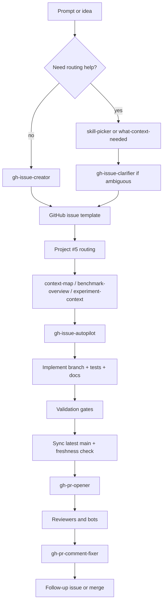

# AI Coding Workflow

[Back to Documentation Index](../README.md)

This note describes the current end-to-end AI-assisted workflow in `robot_sf_ll7`.
It is the repo-native path from a rough prompt to a tracked issue, an implemented branch,
validation, PR review, and follow-up cleanup.

## What This Workflow Optimizes For

- Markdown-first traceability for decisions, context, and handoffs.
- Config-first reproducibility for training and benchmark runs.
- Conservative validation before PR creation.
- One canonical instruction tree for all supported coding-agent runtimes.
- Follow-up issues instead of hidden scope creep.

## Canonical Surfaces

Read these first when working in this workflow:

- [AGENTS.md](../../AGENTS.md)
- [docs/dev_guide.md](../dev_guide.md)
- [docs/README.md](../README.md)
- [docs/ai/repo_overview.md](repo_overview.md)
- [docs/context/README.md](../context/README.md)
- [docs/context/issue_713_batch_first_issue_workflow.md](../context/issue_713_batch_first_issue_workflow.md)
- [docs/context/issue_728_coding_agents_compatibility.md](../context/issue_728_coding_agents_compatibility.md)
- [docs/project_prioritization.md](../project_prioritization.md)
- [docs/dev/training_protocol_template.md](../dev/training_protocol_template.md)
- [docs/context/issue_691_benchmark_fallback_policy.md](../context/issue_691_benchmark_fallback_policy.md)
- [memory/MEMORY.md](../../memory/MEMORY.md)
- [.agents/skills/README.md](../../.agents/skills/README.md)

## End-To-End Flow

### 1. Route the request

Use the smallest useful routing skill first:

- `skill-picker` when the right workflow is unclear.
- `what-context-needed` when the prompt is underspecified.
- `gh-issue-clarifier` when an issue needs scope tightening or decision options.
- `benchmark-overview` or `experiment-context` for benchmark, planner, or training work.
- `quality-playbook` for non-trivial work that needs proof-first planning.

The goal is to avoid jumping directly into edits before the problem, scope, and validation path are clear.

### 2. Create or repair the issue

Use `gh-issue-creator` to turn the request into a repo-ready issue.

Pick the narrowest GitHub issue template that fits the task:

- `issue_default.md` for mixed or vague requests.
- `documentation.md` for guides and workflow docs.
- `benchmark_experiment.md` for benchmark or scenario work.
- `enhancement.md`, `refactor.md`, `research.md`, or `planner_integration.md` when the task clearly fits one of those shapes.

Keep the issue body explicit about:

- goal or problem,
- scope and out-of-scope items,
- added value,
- effort and complexity,
- risk,
- affected files,
- definition of done,
- success metrics,
- validation and testing,
- estimate discussion,
- project metadata.

If the issue is ambiguous, do not guess. Clarify the open questions first and keep the scope narrow.

### 3. Route GitHub issue metadata

Use GitHub MCP or the `gh` CLI depending on which is most reliable for the current step.

For batches of issues:

1. Clean up issue text, labels, and comments first.
2. Route Project #5 metadata second.
3. Run derived score sync last, once per batch.

The priority workflow uses [docs/project_prioritization.md](../project_prioritization.md) as the rubric.
The fields to review are:

- Improvement
- Success Probability
- Time Criticality
- Unlock Factor
- Expected Duration in Hours
- Priority Score

Set values conservatively and only write them back after a plausibility check.

### 4. Gather context and plan

Use the context and planning skills to avoid broad or unfocused edits:

- `context-map` for multi-file discovery.
- `benchmark-overview` for benchmark semantics and artifact surfaces.
- `experiment-context` for config-first training and evaluation paths.
- `review-and-refactor` for a narrow review-then-edit pass.
- `update-docs-on-code-change` whenever code changes would stale docs.
- `context-note-maintainer` when the work produces durable reasoning or validation notes.

For training and evaluation work, the config is part of the traceability record. Commit the config,
record the protocol, and keep the run reproducible through a versioned YAML surface and a docs note.

### 5. Implement the issue

Use `gh-issue-autopilot` when the goal is to take an issue from intake to implementation.

The expected implementation loop is:

1. Inspect the issue and linked context.
2. Create or switch to a branch.
3. Make the smallest change that satisfies the scope.
4. Add or update tests and docs as part of the same change.
5. Split deferred work into follow-up issues.

Do not expand scope silently. If the issue grows, stop and split the extra work into a follow-up issue.

### 6. Validate before PR creation

Use the repository gates before the PR is opened:

- `scripts/dev/ruff_fix_format.sh`
- `scripts/dev/run_tests_parallel.sh`
- `BASE_REF=origin/main scripts/dev/pr_ready_check.sh`

The standard readiness flow is fail-fast and failed-first by default. If a failure appears, assess test value first before changing or removing tests.

The PR readiness gate also checks:

- changed-files coverage, with an 80 percent minimum by default,
- touched-definition docstring TODO warnings,
- full test execution through the shared parallel wrapper.

For benchmark-sensitive changes, use the canonical benchmark command or smoke path and treat fallback or degraded execution as diagnostic only, not as success.

### 7. Open the PR

Use `gh-pr-opener` after the branch has been synced with the latest `origin/main` and the readiness stamp is fresh.

The PR body should come from `.github/PULL_REQUEST_TEMPLATE/pr_default.md` and keep the template sections intact.

PR creation should only happen after the branch diff shows the issue scope is actually implemented.

### 8. Review and fix comments

Automated and online reviewers may include:

- CodeRabbit,
- Gemini,
- Codex,
- Copilot.

Treat these tools as reviewers, not as the source of truth. The source of truth is still the repo-native code, docs, tests, and validation commands.

When comments arrive, use `gh-pr-comment-fixer` or the equivalent local edit flow:

1. Read the comment and decide whether it is actionable.
2. Make the smallest justified fix.
3. Re-run validation.
4. Push the fix.
5. Resolve the review thread only after the fix is landed.

### 9. Close the loop

When work is deferred, create a follow-up issue rather than leaving the remainder hidden in chat or PR text.

Keep the parent issue open until the branch is ready for merge or the repository process says otherwise.

Every substantial step should leave a durable Markdown trace in either `docs/context/` or `memory/`:

- use `docs/context/` for issue history, execution notes, and validation evidence,
- use `memory/` for stable cross-session facts that will be reused later.

## Cross-Agent Compatibility

Robot SF keeps one canonical instruction tree and mirrors it to the supported agent runtimes.

- `.agents/` is the source of truth.
- `.codex/`, `.opencode/`, `.claude/`, `.github/`, and `.gemini/` are compatibility surfaces.
- When needed, `scripts/tools/sync_ai_config.py` checks or repairs the symlinked mirrors.

The goal is not to maintain separate rule sets for different agents. The goal is to keep one
instruction source and expose it through the supported entry points.

## Benchmark And Training Traceability

For benchmark and training work, keep these rules in mind:

- use committed configs as the primary execution contract,
- document the run in a Markdown note,
- keep the artifact root under `output/`,
- record the command path that produced the result,
- do not count fallback or degraded behavior as a successful benchmark outcome unless the fallback itself is the subject of the note.

The repository already treats Markdown as the backbone of durable documentation, so training notes,
benchmark notes, issue notes, and PR text should reinforce the same traceability chain instead of inventing a second one.

## Mermaid Overview



## Practical Default Commands

```bash
scripts/dev/ruff_fix_format.sh
scripts/dev/run_tests_parallel.sh
BASE_REF=origin/main scripts/dev/pr_ready_check.sh
uv run python scripts/dev/pr_ready_freshness.py status --base-ref origin/main
uv run python scripts/tools/project_priority_score.py sync --owner ll7 --project-number 5
```

## What This Note Does Not Replace

- It does not replace `AGENTS.md`.
- It does not replace `docs/dev_guide.md`.
- It does not replace the issue templates or the PR template.
- It does not replace the benchmark-specific or planner-specific notes.

It only explains how the repository expects AI-assisted work to move from idea to merged change.