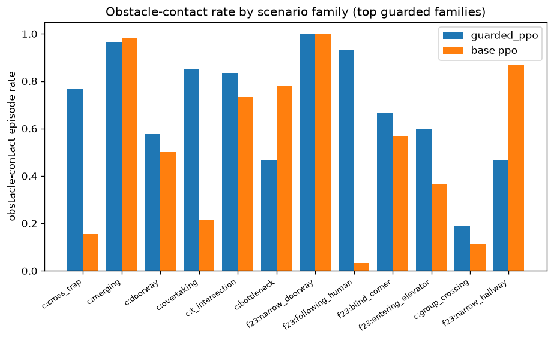
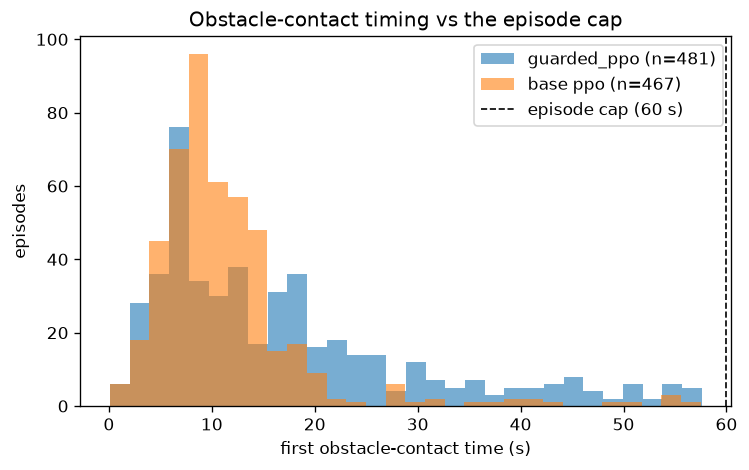
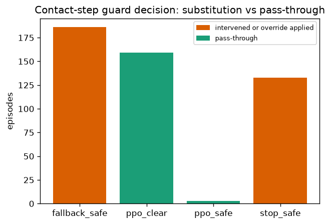

# Guarded-PPO obstacle contacts in the frozen 0.0.6 campaign

Claim boundary: descriptive analysis of the frozen release bundle only. No episode was
stepped or rerun, no checkpoint retrained, no runtime changed.
Evidence tier: diagnostic-only reading of retained episode records; no causal, planner-general,
paper, or benchmark-success claim follows.

## Input identity

- Campaign: `benchmark_0_0_6_s30_h600_20260911`; release tag: `paper-matrix-v2-h600-s30-31cdfe0361abe2c520117a17f99c1b7a0aba4359`.
- Source commit: `31cdfe0361abe2c520117a17f99c1b7a0aba4359`.
- Scenario matrix: `configs/scenarios/classic_interactions_francis2023.yaml`; publication hash `152eba3969a9`;
  release SHA-256 `d9e148e4b544b4c7e2b6ba98e599aef47046d114e0e25645f021946674cb9dc5`.
- Seeds: `paper_eval_s30` = 111–140;
  horizon/dt: `600` steps / `0.1` s.
- Payload checksums: `111` files / `740933980` bytes
  verified against `publication_manifest.json` totals. The top-level publication manifest itself is
  not in `checksums.sha256`; its authenticity is not independently checksum-covered here.
- Release asset declared SHA-256: `61b865fdde65455a39a68221d7c65b0eff315bfa51b4c0bfe34aed3c5d4f3e8e`; local archive verification: `verified`.
- Arms: `guarded_ppo__differential_drive` (BR-06 v3 checkpoint behind the runtime guard) and
  `ppo__differential_drive` (different checkpoint, no guard) — descriptive comparison only,
  not a clean guard ablation because the checkpoints differ.
- Guarded config: `configs/algos/guarded_ppo_camera_ready_cpu.yaml` SHA-256 `69f273f311590009a344f3a88592cb19f54524d252f469ab5fc66f7cf2c9e772`;
  model `ppo_expert_br06_v3_15m_all_maps_randomized_20260304T075200` declared checkpoint SHA-256 `8367af109a27e8879ced0c8913f6eff26df7ec59c31ea88f9a297bb2c141eb09`.
- Base config: `configs/baselines/ppo_issue_791_eval_aligned_large_capacity_cpu.yaml` SHA-256 `51ccfbf4400a306b355e2c3f0f46eda3489d5ce3bc85beaa023a6a1da9c9fb41`;
  model `ppo_expert_issue_791_reward_curriculum_eval_aligned_large_capacity_20260417` declared checkpoint SHA-256 `2b30df812bfcc737924b126b0763d69c567fe20716dc1c1eba8f56f926b49c1d`.
  Predictive model `predictive_proxy_selected_v2_full` declared checkpoint SHA-256
  `a28aed6d6ad7e1ebf597277ade1cf908efa6da038d0a9fcfdf80c7c31d8d1be1`.

Selected arm config/checkpoint identities are bound in the machine-readable validation output:
both configs match the release-manifest SHA, both declared checkpoint identities match the
preflight manifest, and every retained row records a loaded, non-fallback runtime. The declared
checkpoint SHA values are registry declarations; checkpoint bytes are not part of this bundle.

## Availability matrix (what the bundle can and cannot answer)

| Issue packet item | Verdict | Reason |
| --- | --- | --- |
| Retained contact table | available (see `issue_9480_guarded_ppo_obstacle_trade_rows.json`) | cell/map file/seed/time and derived step retained; one row per contact episode |
| Contact x/y or wall-segment geometry | NA | no per-step positions retained |
| Pedestrian within clearance in preceding N steps | NA | no step traces |
| Guard labels/override fields per contact episode | available | retained guard aggregates and final decision fields |
| Guard active in last-k-steps window | NA | per-step decision series not retained |
| Base-PPO same retained-field view | available | episode-level fields only |
| Per-map overlay figure | substituted | family-rate bars + timing histogram instead (no positions) |

## Table 7.1 verification

| arm | episodes | ped mean | obstacle mean | success | timeouts |
| --- | --- | --- | --- | --- | --- |
| guarded_ppo | 1440 | 0.0174 | 0.334 | 329/1440 | 605 |
| base ppo | 1440 | 0.0986 | 0.3243 | 796/1440 | 35 |

Guarded obstacle mean (0.334) matches Table 7.1 (0.33); base PPO is nearly identical
(0.3243). The retained guarded summary has fewer pedestrian contacts
(0.0174 vs 0.0986), fewer successes
(329 vs 796), and more timeouts (605 vs 35).
These are descriptive differences between two checkpoints; they do not identify a guard effect.

## Obstacle-contact rate by scenario family

| family | guarded contacts / episodes (rate) | base contacts / episodes (rate) |
| --- | --- | --- |
| classic_cross_trap | 69/90 (0.767) | 14/90 (0.156) |
| classic_merging | 58/60 (0.967) | 59/60 (0.983) |
| classic_doorway | 52/90 (0.578) | 45/90 (0.500) |
| classic_overtaking | 51/60 (0.850) | 13/60 (0.217) |
| classic_t_intersection | 50/60 (0.833) | 44/60 (0.733) |
| classic_bottleneck | 42/90 (0.467) | 70/90 (0.778) |
| francis2023_narrow_doorway | 30/30 (1.000) | 30/30 (1.000) |
| francis2023_following_human | 28/30 (0.933) | 1/30 (0.033) |
| francis2023_blind_corner | 20/30 (0.667) | 17/30 (0.567) |
| francis2023_entering_elevator | 18/30 (0.600) | 11/30 (0.367) |
| classic_group_crossing | 17/90 (0.189) | 10/90 (0.111) |
| francis2023_narrow_hallway | 14/30 (0.467) | 26/30 (0.867) |
| francis2023_entering_room | 12/30 (0.400) | 4/30 (0.133) |
| classic_station_platform | 9/30 (0.300) | 14/30 (0.467) |
| classic_head_on_corridor | 6/60 (0.100) | 8/60 (0.133) |
| classic_urban_crossing | 2/30 (0.067) | 7/30 (0.233) |
| francis2023_crowd_navigation | 1/30 (0.033) | 1/30 (0.033) |
| francis2023_exiting_elevator | 1/30 (0.033) | 17/30 (0.567) |
| francis2023_exiting_room | 1/30 (0.033) | 3/30 (0.100) |
| classic_realworld_double_bottleneck | 0/30 (0.000) | 28/30 (0.933) |
| francis2023_accompanying_peer | 0/30 (0.000) | 0/30 (0.000) |
| francis2023_circular_crossing | 0/30 (0.000) | 0/30 (0.000) |
| francis2023_down_path | 0/30 (0.000) | 0/30 (0.000) |
| francis2023_frontal_approach | 0/30 (0.000) | 0/30 (0.000) |
| francis2023_intersection_no_gesture | 0/30 (0.000) | 5/30 (0.167) |
| francis2023_intersection_proceed | 0/30 (0.000) | 6/30 (0.200) |
| francis2023_intersection_wait | 0/30 (0.000) | 6/30 (0.200) |
| francis2023_join_group | 0/30 (0.000) | 6/30 (0.200) |
| francis2023_leading_human | 0/30 (0.000) | 0/30 (0.000) |
| francis2023_leave_group | 0/30 (0.000) | 1/30 (0.033) |
| francis2023_parallel_traffic | 0/30 (0.000) | 9/30 (0.300) |
| francis2023_pedestrian_obstruction | 0/30 (0.000) | 0/30 (0.000) |
| francis2023_pedestrian_overtaking | 0/30 (0.000) | 0/30 (0.000) |
| francis2023_perpendicular_traffic | 0/30 (0.000) | 10/30 (0.333) |
| francis2023_robot_crowding | 0/30 (0.000) | 0/30 (0.000) |
| francis2023_robot_overtaking | 0/30 (0.000) | 2/30 (0.067) |

Shared wall-heavy cells (merging ~0.97, narrow_doorway 1.00 both arms, doorway,
t_intersection, bottleneck) hit both checkpoints. Divergences are descriptive only: the
checkpoints differ, so no family delta isolates the guard.

## Contact timing vs the episode cap

Guarded contact times (s): n=481, median=13.0, p90=38.8, max=57.6.
Base contact times (s): n=467, median=9.6, p90=17.6, max=57.5.
Contacts after 50 s of the 60 s cap: guarded 18/481, base 5/467.

Contacts skew early/mid-episode for both arms; guarded contacts occur later in this retained
comparison. Without per-step traces, this timing difference does not identify a runtime effect.

## Guard cross-tabulation (guarded arm, 481 contact episodes)

Per-episode guard decisions over 82473 contact-episode steps: ppo_clear=21607, ppo_safe=982, prior=0, fallback=29496, stop=30388, uncertainty=0.

Final (contact-step) decisions: fallback_safe=186, ppo_clear=159, ppo_safe=3, stop_safe=133.

In 319/481 contact episodes the final decision was a real substitution (`intervened` or `override_applied`); `ppo_safe` is a pass-through, not a substitution. The pass-through total is 162/481 (`ppo_safe` 3 plus `ppo_clear` 159).
These fields are descriptive only: without step traces we cannot distinguish unavoidable contact
from early commitment or fallback steering. The configured guard obstacle clearance (0.30 m),
short-horizon rollout, and fallback DWA weights (goal progress 4.5 vs obstacle clearance 1.2)
provide context, not an outcome attribution.

## Pedestrian proximity in contact vs clean episodes (guarded arm)

Mean pedestrian near-miss events per step: contact episodes 0.03118, clean episodes 0.06829. Episodes with any near-miss: 67/481 contact vs 361/934 clean.

Wall-contact episodes have a lower retained pedestrian near-miss proxy in this comparison.
That association is descriptive; no pedestrian-to-wall mechanism can be established without
the unavailable step traces.

## Verified implementation facts (code, not prose)

- Training reward `route_completion_v3` (un-overridden): collision -10.0 covers pedestrian/robot/obstacle alike;
  `near_miss` -1.0 is pedestrian-only (`snqi_proxy`: robot-ped min distance); `ttc_risk` -0.8 falls back
  to `near_misses` because PPO env metadata never sets `time_to_collision` — hence effectively pedestrian-only
  in training. The issue prose's -1.5/-1.2 values do not match the frozen code.
- Guard thresholds are NOT pedestrian-only: `guard_hard_ped_clearance` 0.58 m,
  `guard_hard_obstacle_clearance` 0.30 m, `guard_min_ttc` 0.70 s; fallback DWA weights pedestrian
  clearance 2.0 vs obstacle clearance 1.2 with goal progress 4.5.

## Diagnostic synthesis (not paper evidence)

In the frozen 0.0.6 retained summaries, the guarded checkpoint has lower pedestrian contact
(0.017 per episode) while obstacle contact (0.334) is close to the other checkpoint (0.324);
its success count is 329/1440 versus 796/1440 and its timeout count is 605 versus 35.
Contacts cluster in constrained cells and early-to-mid episode times, and 319/481 contact episodes
end with a guard decision that intervened or applied an override; the 3 `ppo_safe` pass-through
cases are not substitutions. These observations are diagnostic summaries, not causal or benchmark
claims: the checkpoints differ and the bundle retains no step trace for the final contact mechanism.

Machine-readable table: `issue_9480_guarded_ppo_obstacle_trade_rows.json`.
Report schema: `issue_9480_guarded_obstacle_trade_report.v1`.
