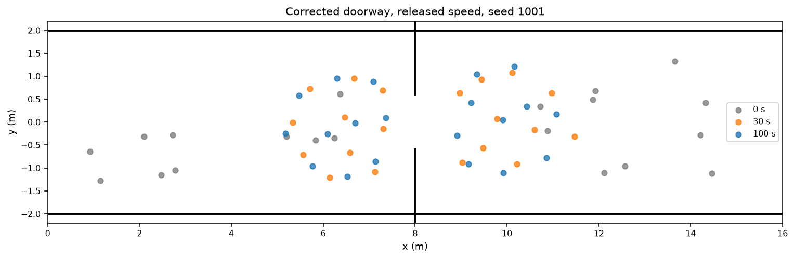

<!-- AI-GENERATED (robot_sf#10056, 2026-09-30) - NEEDS-REVIEW -->
Corrected-wall diagnostic comparisons. AI-GENERATED NEEDS-REVIEW. No benchmark, paper, or dissertation admission.

Defect proof: endpoint order (x1,y1,x2,y2), seed 1001.

| Scene | Wall | Intended | Main actual | Corrected actual |
|---|---|---|---|---|
| bidirectional_corridor | 0 | [-1, 2.5, 25, 2.5] | [-1, 25, 2.5, 2.5] | [-1, 2.5, 25, 2.5] |
| bidirectional_corridor | 1 | [-1, -2.5, 25, -2.5] | [-1, 25, -2.5, -2.5] | [-1, -2.5, 25, -2.5] |
| narrow_doorway | 0 | [-1, 2, 17, 2] | [-1, 17, 2, 2] | [-1, 2, 17, 2] |
| narrow_doorway | 1 | [-1, -2, 17, -2] | [-1, 17, -2, -2] | [-1, -2, 17, -2] |
| narrow_doorway | 2 | [8, 0.6, 8, 3] | [8, 8, 0.6, 3] | [8, 0.6, 8, 3] |
| narrow_doorway | 3 | [8, -0.6, 8, -3] | [8, 8, -0.6, -3] | [8, -0.6, 8, -3] |
| high_density_exit | 0 | [-1, 4, 12, 4] | [-1, 12, 4, 4] | [-1, 4, 12, 4] |
| high_density_exit | 1 | [-1, -4, 12, -4] | [-1, 12, -4, -4] | [-1, -4, 12, -4] |
| high_density_exit | 2 | [-1, -4, -1, 4] | [-1, -1, -4, 4] | [-1, -4, -1, 4] |
| high_density_exit | 3 | [10, 0.6, 10, 5] | [10, 10, 0.6, 5] | [10, 0.6, 10, 5] |
| high_density_exit | 4 | [10, -0.6, 10, -5] | [10, 10, -0.6, -5] | [10, -0.6, 10, -5] |

Dev probe: released calibration, seed 1001, 100 steps; these are development diagnostics.

| Scene | Metric | Main | Corrected |
|---|---|---|---|
| bidirectional_corridor | lane_segregation_index | 0.190496 | 0.0653817 |
| bidirectional_corridor | lane_purity | 0.321895 | 0.267974 |
| narrow_doorway | oscillation_flips | 2 | 0 |
| narrow_doorway | throughput_peds_per_sec | 1.08911 | 0 |
| narrow_doorway | mean_burst_windows | 1.33333 | 0 |
| high_density_exit | exit_density_ratio | 4.99908 | 1.88774 |
| high_density_exit | arch_lateral_spread | 0.748522 | 0.823658 |

Other corrected raw-tuple callers: seed 1001, 10 simulator steps.

| Caller/layout | Main mean displacement (m) | Corrected mean displacement (m) |
|---|---|---|
| scenario_generator/bottleneck | 0.548773 | 0.543641 |
| scenario_generator/maze | 0.514755 | 0.385539 |
| forces_benchmark/sampled | 1.09543 | 1.12041 |

Original bundles and schedules: demo seed 5149 (6 runs); #5149 face validity seeds 5149..5158 (60); #6962 sensitivity 2 lengths × 2 widths × 2 populations × 2 horizons × 2 calibrations × seeds 5149..5158 (320); #6969 reference 2 conditions × 2 calibrations × seeds 5149..5151 (12); Stage A 8 LHS + 2 anchors × seeds 5149..5151 (30), profile RNG 6969. Every original row was rerun; no reduction. Reference/Stage A use warmup 100, observation 200, length 24 m, half-width 2.5 m, 24 pedestrians, strides 1/2/4, recycle margin 0.2 m, lane offset 0.85 m, entry span 1.2 m. #6962 uses lengths 16/24 m, widths 3.5/5 m, populations 16/24, steps 200/400, LSI thresholds 0.15/0.3/0.5 and purity thresholds 0.4/0.6/0.8.

#5149 single-seed demo: original configuration, 400/500/500 steps.

| Scene | Calibration | Metric | Original | Main replay | Corrected |
|---|---|---|---|---|---|
| bidirectional_corridor | released_default | lane_purity | 0.368159 | 0.368159 | 0.476368 |
| bidirectional_corridor | released_default | lane_segregation_index | 0.231369 | 0.231369 | 0.275216 |
| bidirectional_corridor | literature_typical | lane_purity | 0.414594 | 0.414594 | 0.414594 |
| bidirectional_corridor | literature_typical | lane_segregation_index | 0.282953 | 0.282953 | 0.253279 |
| narrow_doorway | released_default | mean_burst_windows | 2 | 2 | 0 |
| narrow_doorway | released_default | oscillation_flips | 3 | 3 | 0 |
| narrow_doorway | released_default | throughput_peds_per_sec | 0.359281 | 0.359281 | 0 |
| narrow_doorway | literature_typical | mean_burst_windows | 1.75 | 1.75 | 2 |
| narrow_doorway | literature_typical | oscillation_flips | 3 | 3 | 2 |
| narrow_doorway | literature_typical | throughput_peds_per_sec | 0.359281 | 0.359281 | 0.11976 |
| high_density_exit | released_default | arch_lateral_spread | 0.855374 | 0.855374 | 0.889683 |
| high_density_exit | released_default | exit_density_ratio | 6.82348 | 6.82348 | 2.20895 |
| high_density_exit | literature_typical | arch_lateral_spread | 0.73042 | 0.718154 | 0.696557 |
| high_density_exit | literature_typical | exit_density_ratio | 7.66447 | 7.44323 | 2.12866 |

#5149 multiseed: all order parameters (10 seeds per row).

| Scene | Calibration | Metric | Original mean | Main replay mean | Corrected mean | Corrected SD | Corrected range |
|---|---|---|---|---|---|---|---|
| bidirectional_corridor | literature_typical | lane_purity | 0.325 | 0.325 | 0.321393 | 0.0479058 | [0.250415, 0.414594] |
| bidirectional_corridor | literature_typical | lane_segregation_index | 0.151286 | 0.151286 | 0.129009 | 0.0943529 | [0.0150327, 0.253279] |
| bidirectional_corridor | released_default | lane_purity | 0.363972 | 0.352363 | 0.369527 | 0.0570642 | [0.256219, 0.476368] |
| bidirectional_corridor | released_default | lane_segregation_index | 0.152696 | 0.158178 | 0.143861 | 0.0849753 | [0.0402965, 0.288867] |
| high_density_exit | literature_typical | arch_lateral_spread | 0.701503 | 0.695322 | 0.694827 | 0.0111731 | [0.68061, 0.719989] |
| high_density_exit | literature_typical | exit_density_ratio | 7.44091 | 7.39631 | 2.15949 | 0.0670349 | [2.08119, 2.28129] |
| high_density_exit | released_default | arch_lateral_spread | 0.843171 | 0.858032 | 0.876661 | 0.0112545 | [0.854199, 0.889683] |
| high_density_exit | released_default | exit_density_ratio | 6.95332 | 7.01264 | 2.21195 | 0.0651143 | [2.08482, 2.31262] |
| narrow_doorway | literature_typical | mean_burst_windows | 2.04167 | 2.04167 | 2.4 | 0.729451 | [1.33333, 3.5] |
| narrow_doorway | literature_typical | oscillation_flips | 1.8 | 1.8 | 1.8 | 0.421637 | [1, 2] |
| narrow_doorway | literature_typical | throughput_peds_per_sec | 0.363273 | 0.363273 | 0.129741 | 0.0270261 | [0.0798403, 0.179641] |
| narrow_doorway | released_default | mean_burst_windows | 2.19167 | 2.12667 | 0 | 0 | [0, 0] |
| narrow_doorway | released_default | oscillation_flips | 3.2 | 3.4 | 0 | 0 | [0, 0] |
| narrow_doorway | released_default | throughput_peds_per_sec | 0.351297 | 0.351297 | 0 | 0 | [0, 0] |

Unchanged phenomenon verdict thresholds: LSI 0.5 clear / 0.15 weak, reversals 2 clear, exit density ratio 2 clear.

| Scene | Calibration | Original verdicts | Corrected verdicts |
|---|---|---|---|
| bidirectional_corridor | literature_typical | {'absent_or_negligible': 6, 'weak_partial': 4} | {'absent_or_negligible': 6, 'weak_partial': 4} |
| bidirectional_corridor | released_default | {'absent_or_negligible': 5, 'weak_partial': 5} | {'absent_or_negligible': 5, 'weak_partial': 5} |
| high_density_exit | literature_typical | {'clearly_present': 10} | {'clearly_present': 10} |
| high_density_exit | released_default | {'clearly_present': 10} | {'clearly_present': 10} |
| narrow_doorway | literature_typical | {'absent_or_negligible': 5, 'clearly_present': 5} | {'absent_or_negligible': 2, 'clearly_present': 8} |
| narrow_doorway | released_default | {'absent_or_negligible': 1, 'clearly_present': 9} | {'absent_or_negligible': 10} |

#6962 full sensitivity: every cell; geometry column is length/width/N/steps.

| Calibration | Cell | Original LSI | Corrected LSI | Original SD | Corrected SD | Original weak/mid/clear | Corrected weak/mid/clear | Original purity | Corrected purity |
|---|---|---|---|---|---|---|---|---|---|
| literature_typical | 16/3.5/16/200 | 0.1634 | 0.133754 | 0.1115 | 0.0977956 | 0.4/0.2/0.0 | 0.4/0/0 | 0.4056 | 0.445173 |
| literature_typical | 16/3.5/16/400 | 0.1449 | 0.123923 | 0.1073 | 0.0860997 | 0.4/0.1/0.0 | 0.3/0/0 | 0.3858 | 0.402923 |
| literature_typical | 16/3.5/24/200 | 0.1598 | 0.0946059 | 0.0765 | 0.0523552 | 0.5/0.0/0.0 | 0.2/0/0 | 0.3257 | 0.340924 |
| literature_typical | 16/3.5/24/400 | 0.1474 | 0.104788 | 0.0879 | 0.0702672 | 0.5/0.0/0.0 | 0.4/0/0 | 0.3015 | 0.3216 |
| literature_typical | 16/5.0/16/200 | 0.1517 | 0.15571 | 0.1083 | 0.112205 | 0.5/0.2/0.0 | 0.4/0.2/0 | 0.377 | 0.412995 |
| literature_typical | 16/5.0/16/400 | 0.1522 | 0.145302 | 0.1109 | 0.1031 | 0.4/0.2/0.0 | 0.4/0.1/0 | 0.3711 | 0.388868 |
| literature_typical | 16/5.0/24/200 | 0.1586 | 0.133528 | 0.085 | 0.0969889 | 0.5/0.0/0.0 | 0.4/0.1/0 | 0.3399 | 0.358251 |
| literature_typical | 16/5.0/24/400 | 0.1464 | 0.127994 | 0.1015 | 0.0936878 | 0.4/0.0/0.0 | 0.4/0/0 | 0.3155 | 0.318076 |
| literature_typical | 24/3.5/16/200 | 0.1162 | 0.177037 | 0.0734 | 0.0965751 | 0.3/0.0/0.0 | 0.5/0.1/0 | 0.4594 | 0.438366 |
| literature_typical | 24/3.5/16/400 | 0.1457 | 0.129221 | 0.1103 | 0.0893622 | 0.4/0.1/0.0 | 0.3/0/0 | 0.3773 | 0.398756 |
| literature_typical | 24/3.5/24/200 | 0.1592 | 0.12222 | 0.0648 | 0.0688224 | 0.6/0.0/0.0 | 0.2/0/0 | 0.37 | 0.351568 |
| literature_typical | 24/3.5/24/400 | 0.1513 | 0.106714 | 0.0842 | 0.0697305 | 0.5/0.0/0.0 | 0.4/0/0 | 0.3087 | 0.322305 |
| literature_typical | 24/5.0/16/200 | 0.1453 | 0.189566 | 0.0956 | 0.103475 | 0.4/0.1/0.0 | 0.6/0.2/0 | 0.484 | 0.452475 |
| literature_typical | 24/5.0/16/400 | 0.1489 | 0.146143 | 0.1054 | 0.104708 | 0.4/0.1/0.0 | 0.4/0.1/0 | 0.3544 | 0.376493 |
| literature_typical | 24/5.0/24/200 | 0.1447 | 0.13005 | 0.0748 | 0.0589137 | 0.5/0.0/0.0 | 0.4/0/0 | 0.3947 | 0.384076 |
| literature_typical | 24/5.0/24/400 | 0.1513 | 0.129009 | 0.1013 | 0.0943529 | 0.4/0.0/0.0 | 0.4/0/0 | 0.325 | 0.321393 |
| released_default | 16/3.5/16/200 | 0.1395 | 0.295742 | 0.1116 | 0.109624 | 0.4/0.1/0.0 | 0.9/0.5/0.1 | 0.5531 | 0.558911 |
| released_default | 16/3.5/16/400 | 0.181 | 0.11099 | 0.115 | 0.0719504 | 0.5/0.2/0.0 | 0.2/0/0 | 0.4124 | 0.412873 |
| released_default | 16/3.5/24/200 | 0.1833 | 0.295285 | 0.1162 | 0.126028 | 0.6/0.2/0.0 | 0.8/0.5/0 | 0.4938 | 0.508333 |
| released_default | 16/3.5/24/400 | 0.1562 | 0.0886903 | 0.0938 | 0.0512055 | 0.3/0.1/0.0 | 0.2/0/0 | 0.3272 | 0.351036 |
| released_default | 16/5.0/16/200 | 0.1738 | 0.134446 | 0.1063 | 0.0786845 | 0.5/0.2/0.0 | 0.3/0/0 | 0.5575 | 0.519926 |
| released_default | 16/5.0/16/400 | 0.1621 | 0.126126 | 0.1241 | 0.0851881 | 0.4/0.2/0.0 | 0.4/0/0 | 0.419 | 0.396269 |
| released_default | 16/5.0/24/200 | 0.1681 | 0.252571 | 0.098 | 0.146903 | 0.6/0.0/0.0 | 0.7/0.5/0 | 0.4791 | 0.534158 |
| released_default | 16/5.0/24/400 | 0.1555 | 0.115922 | 0.0864 | 0.0723602 | 0.5/0.0/0.0 | 0.4/0/0 | 0.3022 | 0.323964 |
| released_default | 24/3.5/16/200 | 0.1749 | 0.348624 | 0.141 | 0.1397 | 0.5/0.2/0.0 | 0.9/0.6/0.1 | 0.7538 | 0.773267 |
| released_default | 24/3.5/16/400 | 0.1785 | 0.180049 | 0.0996 | 0.0856418 | 0.5/0.2/0.0 | 0.7/0/0 | 0.4743 | 0.414303 |
| released_default | 24/3.5/24/200 | 0.1219 | 0.297637 | 0.0974 | 0.131337 | 0.3/0.1/0.0 | 0.9/0.3/0.1 | 0.6077 | 0.633911 |
| released_default | 24/3.5/24/400 | 0.1497 | 0.116717 | 0.0896 | 0.0594865 | 0.4/0.1/0.0 | 0.1/0/0 | 0.3791 | 0.361318 |
| released_default | 24/5.0/16/200 | 0.1526 | 0.404541 | 0.1191 | 0.25678 | 0.4/0.2/0.0 | 0.7/0.7/0.3 | 0.6593 | 0.735644 |
| released_default | 24/5.0/16/400 | 0.152 | 0.174194 | 0.118 | 0.0999437 | 0.4/0.2/0.0 | 0.5/0.1/0 | 0.4545 | 0.392289 |
| released_default | 24/5.0/24/200 | 0.1611 | 0.215548 | 0.1123 | 0.11228 | 0.4/0.2/0.0 | 0.8/0.2/0 | 0.7025 | 0.564521 |
| released_default | 24/5.0/24/400 | 0.1582 | 0.143861 | 0.0844 | 0.0849753 | 0.5/0.0/0.0 | 0.5/0/0 | 0.3524 | 0.369527 |

#6962 surface statistics.

| Calibration | Metric | Original | Corrected |
|---|---|---|---|
| released_default | lane_segregation_index_mean | 0.160528 | 0.206309 |
| released_default | lane_segregation_index_sd | 0.104049 | 0.146184 |
| released_default | lane_segregation_index_range | [0.0211511, 0.465859] | [0.029156, 0.874307] |
| released_default | weak_hit_rate_range | [0.3, 0.6] | [0.1, 0.9] |
| released_default | clear_hit_rate_max | 0 | 0.3 |
| released_default | cell_mean_range | [0.121943, 0.183264] | [0.0886903, 0.404541] |
| literature_typical | lane_segregation_index_mean | 0.149192 | 0.134348 |
| literature_typical | lane_segregation_index_sd | 0.0908688 | 0.0881278 |
| literature_typical | lane_segregation_index_range | [0.0104353, 0.38076] | [0.0150327, 0.352105] |
| literature_typical | weak_hit_rate_range | [0.3, 0.6] | [0.2, 0.6] |
| literature_typical | clear_hit_rate_max | 0 | 0 |
| literature_typical | cell_mean_range | [0.116244, 0.163359] | [0.0946059, 0.189566] |

#6962 paired effects vs default cell: seed pairing, 100,000 bootstrap draws, RNG 6962. Original: all 15 intervals per calibration contained zero.

| Calibration | Original mean-delta range | Corrected mean-delta range | Corrected CIs containing zero | Comparisons |
|---|---|---|---|---|
| released_default | [-0.0362352, 0.0250856] | [-0.0551703, 0.26068] | 8 | 15 |
| literature_typical | [-0.0350422, 0.0120728] | [-0.0344028, 0.0605576] | 12 | 15 |

#6969 reference: every reported native metric; separated control starts with prescribed lanes and does not demonstrate emergence.

| Condition | Calibration | Metric | Original | Corrected |
|---|---|---|---|---|
| mixed_sustained_flow | released_default | mean_lsi | 0.185677 | 0.213307 |
| mixed_sustained_flow | released_default | lsi_range | [0.068798, 0.275329] | [0.058508, 0.310192] |
| mixed_sustained_flow | released_default | mean_lane_purity | 0.510451 | 0.369912 |
| mixed_sustained_flow | released_default | clear_lsi_hits | 0 | 0 |
| mixed_sustained_flow | released_default | clear_lsi_total | 3 | 3 |
| mixed_sustained_flow | released_default | max_per_run_sampling_lsi_spread | 0.002313 | 0.00461304 |
| mixed_sustained_flow | released_default | max_per_run_sampling_purity_spread | 0.005871 | 0.00917111 |
| mixed_sustained_flow | released_default | recycled_agents_total | 7 | 5 |
| mixed_sustained_flow | literature_typical | mean_lsi | 0.094979 | 0.184753 |
| mixed_sustained_flow | literature_typical | lsi_range | [0.05362, 0.168954] | [0.0421614, 0.334253] |
| mixed_sustained_flow | literature_typical | mean_lane_purity | 0.616062 | 0.559406 |
| mixed_sustained_flow | literature_typical | clear_lsi_hits | 0 | 0 |
| mixed_sustained_flow | literature_typical | clear_lsi_total | 3 | 3 |
| mixed_sustained_flow | literature_typical | max_per_run_sampling_lsi_spread | 0.002503 | 0.00182565 |
| mixed_sustained_flow | literature_typical | max_per_run_sampling_purity_spread | 0.005427 | 0.00466489 |
| mixed_sustained_flow | literature_typical | recycled_agents_total | 66 | 62 |
| separated_lane_control | released_default | mean_lsi | 0.768821 | 0.477616 |
| separated_lane_control | released_default | lsi_range | [0.710422, 0.860164] | [0.450541, 0.526841] |
| separated_lane_control | released_default | mean_lane_purity | 0.849835 | 0.528878 |
| separated_lane_control | released_default | clear_lsi_hits | 3 | 1 |
| separated_lane_control | released_default | clear_lsi_total | 3 | 3 |
| separated_lane_control | released_default | max_per_run_sampling_lsi_spread | 0.000488 | 0.0021657 |
| separated_lane_control | released_default | max_per_run_sampling_purity_spread | 0.003708 | 0.0032686 |
| separated_lane_control | released_default | recycled_agents_total | 11 | 4 |
| separated_lane_control | literature_typical | mean_lsi | 0.936009 | 0.943211 |
| separated_lane_control | literature_typical | lsi_range | [0.931974, 0.938369] | [0.925278, 0.963223] |
| separated_lane_control | literature_typical | mean_lane_purity | 0.99615 | 0.987074 |
| separated_lane_control | literature_typical | clear_lsi_hits | 3 | 3 |
| separated_lane_control | literature_typical | clear_lsi_total | 3 | 3 |
| separated_lane_control | literature_typical | max_per_run_sampling_lsi_spread | 0.00011 | 0.000508059 |
| separated_lane_control | literature_typical | max_per_run_sampling_purity_spread | 0.001383 | 0.00288779 |
| separated_lane_control | literature_typical | recycled_agents_total | 75 | 73 |

#6969 Stage A: 30 original rows, profile RNG 6969, unchanged clear threshold 0.5.

| Profile | Original LSI | Corrected LSI | Original range | Corrected range | Original hits | Corrected hits | Corrected purity |
|---|---|---|---|---|---|---|---|
| anchor_literature_typical | 0.094979 | 0.184753 | [0.05362, 0.168954] | [0.0421614, 0.334253] | 0/3 | 0/3 | 0.559406 |
| anchor_released_default | 0.185677 | 0.213307 | [0.068798, 0.275329] | [0.058508, 0.310192] | 0/3 | 0/3 | 0.369912 |
| lhs_01 | 0.266297 | 0.208295 | [0.044398, 0.397335] | [0.11283, 0.273513] | 0/3 | 0/3 | 0.429868 |
| lhs_02 | 0.325505 | 0.107805 | [0.276264, 0.375808] | [0.0480392, 0.191846] | 0/3 | 0/3 | 0.438394 |
| lhs_03 | 0.050329 | 0.260668 | [0.017988, 0.103521] | [0.19861, 0.334166] | 0/3 | 0/3 | 0.473597 |
| lhs_04 | 0.166729 | 0.201183 | [0.05993, 0.320447] | [0.0880241, 0.323173] | 0/3 | 0/3 | 0.495875 |
| lhs_05 | 0.303452 | 0.18064 | [0.121258, 0.534582] | [0.0696979, 0.312905] | 1/3 | 0/3 | 0.582233 |
| lhs_06 | 0.198768 | 0.242561 | [0.072265, 0.286441] | [0.0902655, 0.350114] | 0/3 | 0/3 | 0.564906 |
| lhs_07 | 0.268017 | 0.160098 | [0.137248, 0.366657] | [0.0789325, 0.264084] | 0/3 | 0/3 | 0.520077 |
| lhs_08 | 0.182663 | 0.212287 | [0.099516, 0.232856] | [0.179372, 0.256786] | 0/3 | 0/3 | 0.493674 |

Preregistration: eligible corrected Stage A profiles = []. Eligibility requires all 3 of 3 Stage A seeds at LSI >= 0.5, excluding fixed anchors. Stage B confirmation requires at least 8/10 of seeds 5152..5161 at LSI >= 0.5. No Stage B run existed to replay. The unchanged eligibility test FAILS for every candidate; the no-candidate stop still applies. Stage B confirmation is NOT EVALUABLE, not a failed 10-seed experiment.

Doorway period: the original harness reports flow reversals, throughput and mean burst windows, not an oscillation period. Reversals alone cannot identify a period; no period is invented. Exit density ratio and spread are diagnostics and do not prove a human-crowd arch. Positive lane controls are prescribed, not spontaneous. Historical macOS/arm64 results may differ from Linux/x86_64 replays; the full same-runtime main replay is preserved in summary.json.

Interpretation by campaign:

- Single-seed demo: exit accumulation remains above the density-ratio threshold but is much weaker; released-speed doorway alternation disappears; literature-speed doorway alternation remains with reduced flow; lane signals remain weak.
- Multiseed face validity: exit ratios fall from 6.9533/7.4409 to 2.2120/2.1595 (released/literature), with 10/10 clear density-ratio hits at both speeds. Released-speed doorway flow and reversals disappear (0/10 clear). Literature-speed mean reversals stay at 1.8, clear hits rise from 5/10 to 8/10, and throughput falls from 0.3633 to 0.1297 pedestrians/s. Neither speed produces clear spontaneous lanes (0/10 at each speed).
- Sensitivity: released-speed surface mean LSI rises from 0.1605 to 0.2063; sparse clear hits now occur, with a maximum of 3/10 in a cell and a maximum per-run LSI of 0.8743. Literature-speed mean LSI falls from 0.1492 to 0.1343 and retains zero clear hits. This screen still does not find a reproducible clear lane regime. Corrected paired-effect confidence intervals contain zero in 8/15 released and 12/15 literature cells (originally 15/15 at each speed).
- Reference: mixed sustained flows remain below the clear lane threshold on every seed. The prescribed released-speed lane control becomes weaker (mean LSI 0.7688 to 0.4776; clear hits 3/3 to 1/3), while the prescribed literature-speed control persists (mean 0.9360 to 0.9432; 3/3 clear). These are controls rather than emergent lane evidence.
- Stage A: every LHS candidate has 0/3 clear hits after correction; originally lhs_05 had 1/3. None passes the frozen 3/3 eligibility rule, so the preregistered no-candidate stop still holds. The Stage B 8/10 rule has not been tested and cannot be labeled a failed ten-seed experiment. Its thresholds and historical source pins were not edited.

The #6960 GIF replay package is derived from the #5149 multiseed rows and adds no separate quantitative claim. Its original selected corridor/doorway seeds (5155/5157 and 5156/5153) are included in the full rerun. Historical GIFs remain historical; the three new snapshots draw the simulator's actual corrected walls and initial pedestrians.

The synthetic #6969 metric audit still passes for all three sampling strides (1, 2, 4): mixed-flow LSI is approximately 0 and separated-flow LSI is approximately 0.99979, matching the original reported audit. The Stage A profiles.json SHA-256 remains byte-identical to the original: e568777ea10c5c98952b7a89fea66cbb5102b857f15b08975c6526c54b26cfbb. The #5149 seeds, scene definitions, calibrations, simulator configuration and verdict thresholds match the original manifest exactly.

Validation: six real-wall regressions fail on base with `AssertionError: Not equal to tolerance rtol=0, atol=1e-09` and pass on the fix. Related importer tests: 378 passed, four deselected. The four excluded tests in tests/test_emergent_phenomena.py step the default seed 123: test_run_scenario_records_full_trajectory_shape, test_run_scenario_computes_finite_order_parameters, test_run_scenario_is_deterministic_given_seed, and test_literature_calibration_runs_faster_than_released. Existing builder tests checked state shape and obstacle count; the new tests inspect actual raw and sampled wall bytes against independent endpoint literals. No skip, xfail, timeout or production test seam was added.

Raw archive SHA-256: 2063d0c848274c465761cbce5dd6622a57a466a674d6246955958bc1bbb91189. Slurm job 15893 completed the demo and face-validity outputs; it stopped before sensitivity simulation on a CLI argument error. Job 15894 completed sensitivity, reference and Stage A after that error was fixed, preserving the earlier outputs. The first two campaigns bind head 9181463f4d42f88b2c5748335ea8cf66b65d85c6; the remaining campaigns bind 004d4157f1d9a8aac3f97af588421c472e4164f5. Simulation sources and dependency lock are identical between those two commits; only the recovery wrapper and regression test changed. Both jobs requested two CPUs, 8 GiB, a30/a30-cpu and a three-hour cap; the original 16-CPU request was canceled while pending. No reduction in seeds, scenarios, horizons or headline metrics occurred.

Reproduce inside a Slurm allocation with `OMP_NUM_THREADS=1 OPENBLAS_NUM_THREADS=1 uv run python scripts/validation/run_issue_10056_wallfix_campaigns.py --output-dir "$EVIDENCE_ROOT"`. The runner prints each resolved schedule and checks both forbidden evaluation sets before execution. `--campaigns sensitivity reference stage_a` resumes the remaining campaigns when demo and face-validity outputs are already preserved. Full raw outputs and the private synthesis/probe scripts remain in the external lane evidence directory; tracked summary.json retains exact command receipts, all old and corrected reported metric summaries, and the same-runtime main replay.

Original #6960 representative replay values, using exactly the archived selected seeds (no new seed selection):

| Scene | Calibration | Seed | Metric | Original | Corrected |
|---|---|---|---|---|---|
| bidirectional_corridor | released_default | 5155 | lane_segregation_index | 0.0661388 | 0.110114 |
| bidirectional_corridor | literature_typical | 5157 | lane_segregation_index | 0.0575945 | 0.0266854 |
| narrow_doorway | released_default | 5156 | oscillation_flips | 3 | 0 |
| narrow_doorway | literature_typical | 5153 | oscillation_flips | 1 | 2 |

Released-speed doorway plausibility (follow-up RR10057). Seeds 1001–1005, separate 300/1000-step runs, original 20-agent bidirectional configuration; 0.1 s per step. Actual walls match intended endpoints within 1e-9. Gap 1.20 m; pedestrian radius 0.35 m, leaving 0.50 m of center-position width for one pedestrian, but less than two diameters (1.40 m) abreast. Jambs are correctly at x=8, y=±0.6 to ±3.

| Seed | Steps | Throughput (peds/s) | Ever within 2 m / 20 | Final within 2 m | Closest door plane (m) | Closest jamb tip (m) | Last 10 s mean speed (m/s) | Slow queue agents |
|---|---|---|---|---|---|---|---|---|
| 1001 | 300 | 0.000 | 19 | 12 | 0.536 | 0.621 | 0.202 | 0 |
| 1001 | 1000 | 0.000 | 20 | 13 | 0.536 | 0.607 | 0.216 | 0 |
| 1002 | 300 | 0.000 | 19 | 14 | 0.583 | 0.605 | 0.188 | 0 |
| 1002 | 1000 | 0.000 | 20 | 13 | 0.487 | 0.584 | 0.189 | 1 |
| 1003 | 300 | 0.000 | 20 | 13 | 0.611 | 0.654 | 0.205 | 0 |
| 1003 | 1000 | 0.000 | 20 | 12 | 0.585 | 0.621 | 0.208 | 0 |
| 1004 | 300 | 0.000 | 17 | 12 | 0.528 | 0.595 | 0.180 | 0 |
| 1004 | 1000 | 0.000 | 20 | 13 | 0.369 | 0.534 | 0.206 | 0 |
| 1005 | 300 | 0.000 | 20 | 13 | 0.429 | 0.591 | 0.190 | 0 |
| 1005 | 1000 | 0.000 | 20 | 12 | 0.388 | 0.496 | 0.185 | 0 |

Approach means center within 2 m of x=8; slow queue means final approach region and mean speed <0.05 m/s over the last 10 s. Closest distances are over the whole trajectory, not the final snapshot. All runs have zero crossing events and zero flow reversals. The compact JSON also retains positions and leading-agent forces at steps 0/100/300/500/1000, including final jamb-tip distances and counts within 1.5 m of the jamb tips. The snapshot overlays initial, 30 s and 100 s positions. Agents reach the approach region, but no center reaches the door plane. They accumulate and mill upstream rather than forming a stationary slow queue under the stated definition.

A lone centerline walker on seed 1001 stalls at x≈6.489, 1.511 m before the door, with speed effectively zero at 100 s. Its obstacle repulsion balances the forward desired force even without other pedestrians. Keeping the same walls but disabling only the obstacle force lets that walker cross once (0.009990 peds/s over 100.1 s). Thus zero flow is a wall-induced stand-off under the released force calibration, not a remaining tuple-order, misplaced-jamb, or physically impossible-gap defect. It is not credible evidence of realistic crowd-induced clogging: even a lone walker cannot traverse. Obstacle-force calibration/potential plausibility is a separate model follow-up; no defaults or thresholds are changed here. Main's 0.63 peds/s at seed 1001/300 steps was obtained with the defective walls.

Full trajectories and probe source/log remain external; their archive SHA-256 is `35916f64185e49eec268a19bf8b0941e07271348e48fdd6b39c7d62019899583`. See `doorway_plausibility.json` for custody, original force settings and time-indexed positions/force components.

