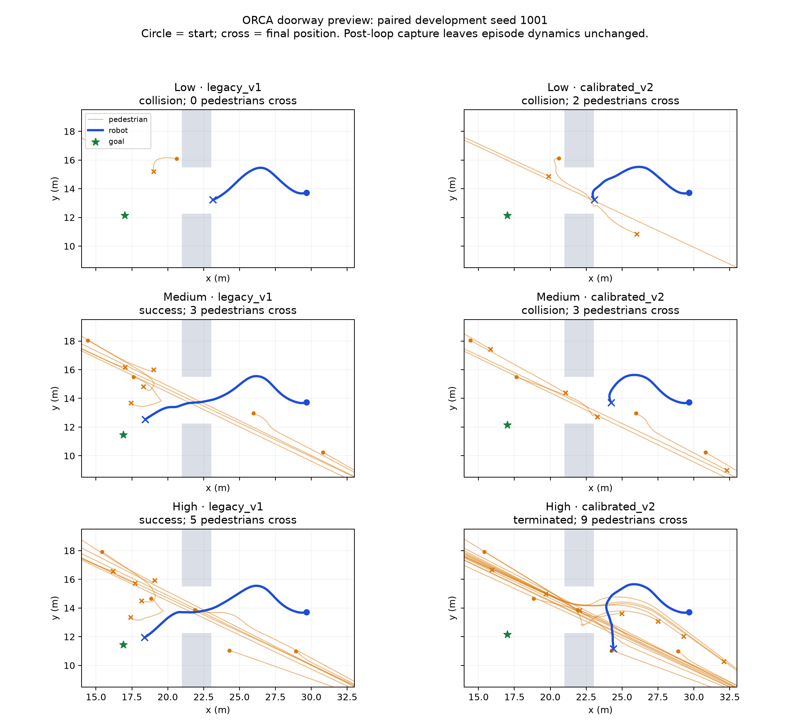

<!-- AI-GENERATED NEEDS-REVIEW -->
# Continuation: corrected gradients and separate experiment cases

Scientific admission remains blocked. The new `gradient_v3` diagnostic uses the existing opt-in fast-pysf `surface_distance_unit_normal_v2` law, factor 0.001, offset +0.40 m, sigma 0. It is evaluated alongside the preserved `calibrated_v2` legacy-law refit; neither is an accepted release setting. Missing profile selection stays `legacy_v1`. No fast-pysf source byte was changed.

For a closest surface distance d, physical radius r=0.40 m, q=d-r, and epsilon=1e-5 m, the chosen potential is U=f/(2q²) above epsilon, continued linearly below epsilon: U=f/(2epsilon²)+f*(epsilon-q)/epsilon³. Its negative gradient is f/max(q,epsilon)³ times the unit normal. The linear continuation explains why the force is nonzero below the distance floor; simply differentiating a flat clamped potential would give zero there. The normal at an exactly coincident surface point remains undefined; the existing implementation returns zero. Strong near-contact force and a speed cap do not constitute a hard collision constraint.

The second diagnostic family has U=A*B*exp(-(d-r)/B), hence F=A*exp(-(d-r)/B)*n. A is acceleration (m/s²), B is range (m), and distance starts at the actual body edge. This family is confined to a diagnostic subprocess hook; it is not installed as a production profile. Published coefficients were not copied.

The new grid contains nine legacy refits and nine true gradients, each factor [0.0003,0.001,0.003] by offset [0.35,0.375,0.40]; nine body-edge exponentials, A [5,15,40] by B [0.02,0.04,0.08]; and the released 10/-0.57 control. Seeds 1001–1010 only. This produces 3,920 lone-aperture runs and 1,120 separate corridor/direct-wall runs. Apertures are 0.8/1.0/1.2/2.0/2.2/2.8/3.6 m, with 0.1 m wall thickness and walking speeds 0.65/1.3 m/s. Approach speed is measured 2–4 m upstream; minimum crossing speed within 1 m of the opening. Free corridor cases begin at 0.25 m physical edge clearance; both centre and edge distances are retained. Perpendicular wall approach is a stress case, distinct from ordinary free walking.

The gradient Pareto candidate is chosen from the screen because it passes all 120 lone apertures at 1.0 m and above and every direct-wall/corridor test without measured footprint penetration. Its 1.0 m speed drops are approximately 0.30 m/s at the released speed and 0.18 m/s at normal speed. It blocks at 0.8 m. A safer legacy refit, 0.0003/+0.40, also passes these aperture and direct-wall gates. The weaker exponential 15/0.04 passes all 1.0 m and wider apertures but penetrates on direct approach; the stronger 40/0.04 avoids that penetration but stalls some 1.0 m apertures. They bracket the observed trade-off, rather than representing an accepted fit.

Narrow flow uses 60 walkers, nominal holding density 3.3/m², three nominal holding sections, the first centred 3 m upstream, and a 4 m upstream corridor, a 2.8 m channel, and measurement at its channel centre (x=1.4 m in the diagnostic). Initial row jitter is explicit and deterministic; individual experimental starting trajectories and body shapes are not replayed. Wide flow uses 350 walkers, nominal density 3/m² in an 8.618 m holding semicircle, a 1 m channel, widths 2.4/3.0/3.6/5.0 m, and free speed 1.55 m/s. The 4.4 m experiment is omitted from this small development grid. Nominal density and supply are matched, but physical packing is not: the required densities force overlapping 0.40 m discs. All initial pair overlaps and minimum separation are recorded; no radius reduction or wall collision clipping is applied. These are explicit model incompatibilities, not physically matched human reconstructions.

All runs retain first-crossing timestamps, centre and edge wall clearance, all-crossed status, and both first-to-last finite-N flow and central 20–80% flow. The latter is a central-period diagnostic, not a proven stationary flow. When fewer than N pedestrians cross, first-to-last flow uses the observed count and is a censored diagnostic; it cannot be equated to a published complete N-person measurement. This distinction prevents a truncated queue from passing an empirical flow gate.

A 0.40 m rigid disc has zero lateral slack in a 0.8 m opening, and the maximum density of nonoverlapping 0.40 m discs even in an unbounded hexagonal packing is only 1/(2sqrt(3)*0.40²)=1.80/m². Both experiments exceed this. Changing only the wall law cannot remove those geometric mismatches. No body geometry, social interaction, timestep or released benchmark policy was changed to make the targets fit.

## Verified literature additions

- [Seyfried et al. 2009, setup and Table 2](https://arxiv.org/html/physics/0702004): N=60 specific flows at 0.8/1.0/1.2 m are 1.61/1.90/1.97 persons/(m·s); channel length 2.8 m, initial density 3.3/m². The paper measures first-to-last crossings at the channel centre, labelled y=0.4 in its local video coordinates. These are complete finite-N measurements, distinct from steady-state capacity.
- [Liao et al. 2014, author-uploaded full text, sections 2 and 4](https://www.researchgate.net/publication/275532668_Experimental_Study_on_Pedestrian_Flow_through_Wide_Bottleneck), [institutional record](https://juser.fz-juelich.de/record/172244): widths 2.4–5.0 m, length 1 m, up to 350 people, initial semicircle radius 8.618 m and density 3/m², free speed 1.55±0.18 m/s. The body text assigns slope about 2.3 to all data and 2.5 to steady-state data. Figure 9's caption reverses that order, while its J=2.5b steady-state fit and the body text agree. Use the body definition; disclose the caption discrepancy. These slopes are distinct estimators, not an interchangeable acceptable band.
- [Wilmut et al. 2015, results and Figure 3](https://journals.plos.org/plosone/article?id=10.1371/journal.pone.0124695): all participants passed the tested apertures without partition contact. Visual reading of the typically developing group gives a speed drop about 0.40 m/s at shoulder/aperture ratio 0.9 and about 0.12–0.16 at 1.3–2.1. The study includes shoulder rotation and trunk motion. Disc-width ratios do not reproduce those body mechanics; measured model speed drops are reported separately, not labelled a direct experimental fit.
- [Ma et al. 2010, original article abstract](https://www.sciencedirect.com/science/article/abs/pii/S0360132310001046), [author-associated abstract](https://www.researchgate.net/publication/245144801_Experimental_study_on_microscopic_moving_characteristics_of_pedestrians_in_built_corridor_based_on_digital_image_processing): the approximately 0.4 m wall-distance statement is verified in the abstract. Accessible material does not define centre versus edge; that ambiguity remains unresolved. It is not converted into an edge-clearance gate. No thesis or paper admission is claimed; Zotero integration remains outside this diagnostic packet.

## Doorway regression mechanism

A transparent post-loop hook captures the production runner's completed trajectories without changing dynamics. All 90 paired doorway episodes reproduce the original preview outcome and step count; the saved trace's minimum robot/pedestrian distance agrees with its metric. Robot policies, map and initial states remain paired. The same map has a 3.297 m opening in a 2 m thick wall; a 1 m robot radius leaves only 1.297 m of usable width for its centre. Its interaction with simultaneous opposing pedestrian streams therefore matters even when lone passage is feasible.

An additional 90 zero-density control episodes preserve the map and planner: ORCA and social_force succeed 5/5 under each profile for every doorway density label; goal succeeds 1/5 in both profiles and already collides with walls without pedestrians. Profile switching has no effect on those empty-crowd results. This rules out a changed robot wall law or newly impassable empty geometry as the source of the observed profile differences.

- High: ORCA success falls 4/5→0/5 (three timeouts, two contacts), while mean unique crossing pedestrians increases 4.6→7.8 and mean nearby doorway occupancy 0.261→1.633. social_force success falls 4/5→0/5 with five timeouts; all nine pedestrians cross under the candidate, versus mean five under legacy. Goal falls 1/5→0/5 with pedestrian contacts. No pedestrian footprint penetrates a wall in either high-profile trace.
- Medium: ORCA falls 3/5→1/5 with two contacts and two timeouts under the candidate; mean unique crossings 2.6→3.8. social_force falls 5/5→0/5 with five timeouts; mean crossings 2.4→6.0 and nearby occupancy 0.077→1.306. Goal stays 1/5. No pedestrian wall penetration occurs in either medium-profile trace.
- Low: ORCA stays 4/5, goal stays 1/5, and social_force falls 5/5→4/5 with one timeout (seed 1001). Candidate occupancy rises, but the sparse stream usually clears. Existing low-density wall-clearance defects are smaller under the candidate: maximum penetration 3.41 cm under legacy versus 1.06 cm under the refit. This is an independently retained defect, not evidence that all low-density physics is acceptable.

The medium/high regressions are supported as consequences of increased pedestrian doorway traffic and robot/crowd interaction in this model. They are not attributed to a new wall penetration, a changed robot planner or reset overlap. Exact attribution between opposing-flow conflict, robot repulsion and planner conservatism remains a model-mechanism question; these traces plus the empty-crowd control do not establish that the resulting human flow is empirically realistic. Calibration still fails its independent dense-flow footprint gate.

## Pareto results of the separate cases

All numbers below combine the final Figure-2-shaped narrow cases with the separately measured wide cases. The first new narrow attempt used an overly wide upstream corridor and read the local video coordinate as an entrance distance; its 150 narrow rows are preserved as superseded diagnostics, excluded from this table and from any fit. The corrected producer uses a 4 m upstream corridor and the channel-centre plane. No experimental individual starting trajectories are replayed, and fixed-body wall margins adapt the initial grid. All five measured candidates are nondominated on the explicitly reported four diagnostic costs (aperture failure rate, maximum flow-wall penetration, provisional narrow-flow error, and all-data wide slope error). Every candidate fails a hard gate; no scalar score overrides that failure.

| Law and parameters | Passes at ≥1.0 m / 120 | Narrow specific flow 0.8 / 1.0 / 1.2 m | Maximum flow wall penetration | Wide slope through origin / free intercept |
|---|---:|---|---:|---|
| Legacy refit 0.003 / +0.375 | 100 | 0.000 / 0.411 / 0.855 | 6.45 cm | 2.580 / 2.062 |
| Legacy refit 0.0003 / +0.400 | 120 | 0.000 / 0.751 / 0.894 | 9.27 cm | 2.537 / 1.979 |
| True gradient 0.001 / +0.400 | 120 | 0.000 / 1.275 / 0.893 | 10.29 cm | 2.551 / 1.957 |
| Body-edge exponential A=15, B=0.04 | 120 | 0.094 / 1.345 / 0.905 | 14.48 cm | 2.713 / 2.125 |
| Body-edge exponential A=40, B=0.04 | 110 | 0.000 / 1.200 / 0.914 | 9.80 cm | 2.658 / 2.113 |

Specific flow and slope units are persons/(m·s). 1.0 m queues cross 56.0–58.8/60 on average by 160 s, so their displayed finite-count flow is censored. The gradient averages 58.2/60, with only 1/10 complete runs. At 0.8 m, the weak exponential crosses only 7.7/60 on average; other candidates cross zero. Every 1.2 m queue and every wide case completes its supply. The 1.2 m flow remains far below the published 1.97, even without censoring. These are failed validation outcomes, not capacities of human crowds.

Through-origin slopes superficially approach the Liao figures, but free-intercept slopes are lower and wide specific flow declines with width. Both estimators are reported rather than selecting the favorable one. All-data flow completes all 350 people in all four wide widths. Central-period flow is archived independently; stationarity is not established and its slope is not compared as though it were the paper's steady-state estimate.

The canonical lane harness was also run with its original 5 m / 24-person case, and separately at 3.0/3.6 m with 48 people, 40 s, ten seeds and both walking-speed calibrations. For the narrower cases only initial lateral positions and corresponding goal lateral positions are constrained to retain 0.05 m body-edge wall clearance. No position is clipped during integration. Initial pedestrian pair overlaps are recorded. The engineering 0.15/0.50 weak/clear correlation thresholds are not empirical formation-time targets.

| Profile | Released-speed mean segregation at 3.0 / 3.6 m | Normal-speed mean segregation at 3.0 / 3.6 m | Clear runs ≥0.5 |
|---|---|---|---|
| legacy_v1 | 0.213 / 0.187 | 0.066 / 0.066 | 0/40 |
| calibrated_v2 | 0.261 / 0.259 | 0.072 / 0.071 | 0/40 |
| gradient_v3 | 0.288 / 0.284 | 0.078 / 0.084 | 0/40 |

The initial mean segregation is about 0.118. At released speed the gradient increases order by about 0.17, but at normal speed its segregation decreases from the initial random sample. This preserves a weak released-speed lane signal; it does not establish robust lane formation across speeds. The 3.0 m normal-speed gradient case also reaches 9 mm of wall penetration. The released legacy control penetrates more severely in these crowd cases; defects in the comparator are retained rather than hidden. [Zhang et al. 2012](https://arxiv.org/abs/1107.5246) motivates the ordering comparison; this harness does not reproduce the paper's empirical lane states or density-flow measurements.

## Current acceptance

| Gate | gradient_v3 result | Decision |
|---|---|---|
| (a) lone aperture passage and slowing | 120/120 at widths ≥1.0 m, both walking speeds; 1.0 m drops 0.30/0.18 m/s; 0/20 at 0.8 m | Pass for ≥1.0 m passage; quantitative human body equivalence unproven |
| (b) wall clearance and zero penetration | free corridor edge 0.268–0.291 m, centre 0.668–0.691 m; zero penetration in lone/direct-wall screen, but 10.29 cm maximum in dense flow and 9 mm in a narrow lane case | **Fail** |
| (c) narrow and wide flow | narrow 0.000/1.275/0.893; 1.0 m censored; wide slope 2.551 through origin, 1.957 with fitted intercept | **Fail**; geometric and dense-supply incompatibility retained |
| (d) corridor lanes | weak released-speed segregation improves, zero clear runs in 3.0/3.6 m cases, normal-speed result below initial order | Partial; robust emergence not demonstrated |
| (e) pedestrian–robot reset overlap | 240/240 gradient/legacy resets have exactly equal pedestrian state and robot poses; zero overlaps under either profile | Pass |

Accepted values: **none**. `gradient_v3` is a versioned measured development point; it is not named or recommended as an accepted calibration. `calibrated_v2` remains the original rejected comparison profile. No parameter changes were made to `legacy_v1`, no force substrate default was changed, and no historical/frozen campaign input was edited. The complete 48-scenario headline preview is the previously recorded legacy/calibrated comparison; a new 48-scenario gradient campaign was not run after its physical gate failed.

A useful next physical study must jointly reconcile pedestrian shape/rotation or footprint convention, collision-safe time integration, and social/contact forces at the named supply densities. Wall-only tuning at fixed 0.40 m discs cannot serve as an accepted empirical reconstruction of these experiments. That is the measured blocker; it is not a recommendation to silently shrink release geometry or repair the benchmark by reducing pedestrian flow.

Source-bound trajectories for seed 1001. The figure is explanatory, not a human-realism validation. The same data are available as [PDF](doorway_traces.pdf). Full per-seed measurements are in [doorway_mechanism_summary.json](doorway_mechanism_summary.json); the separate-case comparison is in [corrected_law_comparison.json](corrected_law_comparison.json). Every raw row and exact producer is preserved in the adjacent marked archives.

## Continuation validation and resource limits

The repeated full default suite at runtime source c9ca7e779f3fa829001523db59376884e4428fa9 reports **13,617 passed, 4 failed, 7 existing skipped and 7 existing xfailed**, in 43 minutes. It used the required -n2 exception, explicit eligible file lists, provenance setup and a collect-only exclusion check. Forty held-out stepping files were excluded; the refined run recorded no seed-guard refusal. The absolute user seed prohibition takes precedence over later lane-rule permission for retired-seed existing tests. No held-out campaign was stepped.

All four failures reproduce on the untouched base: two review-context NFS temporary-entry retirements, one overlay cleanup ENOTEMPTY, and one mocked release stress test whose inherited Slurm launch activates the private-source gate. The captured release reason requires SLURM_EXPECTED_PUBLIC_COMMIT; that gate was retained. All four pass on this host in 5.66 seconds without simulation. This classifies the failures; it does not turn the cluster full suite into a green result. Fourteen force/profile static tests pass in 4.11 seconds, including the independent gradient oracle and both explicit-profile round trips. The new profile test first failed with the unsupported gradient_v3 ValueError. Production ASTs at the final worktree equal the tested runtime source; later edits are diagnostic geometry, supplemental static tests and evidence.

[Validation summary](continuation_validation_summary.json) and [resource receipts](continuation_resource_receipts.json) link exact raw logs and producers. New submissions checked idle a30 capacity and absence of pending work; continuation peak allocated CPUs is 14 and the entire work's peak remains 16. Failed diagnostic producer attempts are retained and excluded from accepted rows. No unrelated Slurm work was modified. No subagents or hosted CI were used.

## Every remaining preview regression

A further 100 paired episodes capture the ten non-doorway rows whose preview success decreases. All outcomes and step counts match the original preview, and trace minimum robot/pedestrian distance matches the metric. Full polygon geometries, including holes, are retained as WKT for signed wall-clearance analysis. These are the exact seeds 1001–1005, runtime source c9ca7e779f3fa829001523db59376884e4428fa9, Slurm job 16049 (two processes, two CPUs, nice 10000).

The table distinguishes altered interaction exposure from unsafe outcomes. Pedestrian speed and nearby occupancy are time-averaged over differently terminated episodes; they are descriptive associations, not unique causal mediators. Near-robot occupancy counts pedestrian centres within 3 m. The final recorded goal is the active route waypoint, not a fixed initial endpoint; no cross-profile progress claim is derived from it.

| Regressing row | Successes legacy→refit /5 | Observed change | Mechanism and defect boundary |
|---|---|---|---|
| classic_bottleneck_high / ORCA | 2→0 | Mean pedestrian speed 0.447→0.559 m/s; both profiles have zero measured pedestrian wall penetration; five candidate robot contacts | Faster moving crowd alters contact timing; new lost seeds 1004/1005 are robot–pedestrian contacts. Traffic consequence in the model; human realism unproven. |
| classic_bottleneck_medium / ORCA | 5→4 | Mean pedestrian speed 0.440→0.587; no pedestrian wall penetration | Lost seed 1003 is **robot/static-geometry contact**, not a pedestrian contact. This is an unsafe planner interaction exposed under changed pedestrian dynamics; causal steering mediator unresolved. |
| classic_cross_trap_high / ORCA | 5→4 | Mean pedestrian speed 1.072→1.211; maximum wall penetration 30.70→27.09 cm | Lost seed 1002 is a robot–pedestrian contact, while that seed's pedestrian penetration decreases 7.06→6.69 cm. Existing invalid crowd clearance contaminates realism; no clean empirical admission. |
| classic_merging_medium / ORCA | 3→2 | Candidate has three contacts versus two; zero pedestrian wall penetration | Lost seeds 1001 (pedestrian contact) and 1004 (**static-geometry contact**); another seed improves. Mixed crowd interaction and unsafe planner contact, not a simple doorway-flow explanation. |
| classic_overtaking_medium / ORCA | 5→4 | Mean pedestrian speed 1.031→1.247; maximum wall penetration 3.33→3.26 cm | Lost seed 1003 is pedestrian contact. Altered relative-speed/encounter timing is consistent with the traces, but existing footprint failure remains. |
| francis2023_blind_corner / ORCA | 5→2 | Nearby occupancy 0.102→0.211; zero pedestrian wall penetration | Lost seeds 1001/1003/1004 are pedestrian contacts; changed corner encounter exposure, not newly penetrated walls. Empirical realism remains unverified. |
| francis2023_exiting_elevator / ORCA | 4→3 | Mean pedestrian speed 0.400→0.472; zero pedestrian wall penetration | Lost seed 1001 is **static-geometry contact** at 4 s, with nearest pedestrian still 4.63 m away. Do not label this desirable realistic crowd difficulty; planner/static-contact attribution needs further study. |
| classic_cross_trap_medium / social_force | 3→2 | Three candidate timeouts versus two; speed 0.954→1.185 | Lost seed 1002 times out with no pedestrian wall penetration. Other seeds retain footprint defects (maximum 6.91→7.28 cm); altered interaction timing is supported, unique deadlock mediator unresolved. |
| francis2023_crowd_navigation / social_force | 4→2 | Nearby occupancy 1.389→2.009; three timeouts versus one | Lost seeds 1003/1004 time out, with nearby occupancy rising 1.513→3.445 and 0.772→2.127. Crowd/robot repulsion or yielding deadlock is consistent; no new pedestrian wall penetration. |
| francis2023_robot_crowding / social_force | 2→0 | Nearby occupancy 3.093→3.693; all five candidate timeouts | Lost seeds 1003/1004 time out; only seed 1004 has higher nearby occupancy. Interaction/deadlock consequence; simple occupancy increase is not a sufficient per-seed explanation. Zero measured pedestrian wall penetration. |

The doorway-medium ORCA loss also includes a new **robot wall contact at seed 1003** (legacy succeeds). Its increased traffic and empty-crowd controls support an interaction change, but that static contact is an unresolved unsafe planner outcome. Doorway-high ORCA and social_force have no robot-wall contacts under the refit; their increased door passage and congestion are the strongest supported traffic consequence. Low doorway already contains robot-wall contacts in both profiles, including ORCA seed 1001; its newly lost social_force seed 1001 is a timeout, with no robot-wall contact.

Thus the regression set cannot be uniformly labelled realistic difficulty: some changes are increased passage/encounter exposure, some expose robot/static-contact failures, and several preserve invalid pedestrian footprint clearance. Robot policy code and wall-force parameters are unchanged; paired initial pedestrian state and robot pose equality is established by the 240 reset pairs. This rules out a new reset overlap, but does not certify planner responses to the altered crowd. Static-contact cases and crowd/body-integration incompatibilities remain blocked within #10061 rather than being repaired by changing frozen robot policies.

[Per-seed extra regression measurements](other_regression_summary.json) retain exact collision partner/type events, signed wall distances and raw trace identities. Together with the doorway packet this covers every one of the 16 decreasing arm/scenario preview rows.
