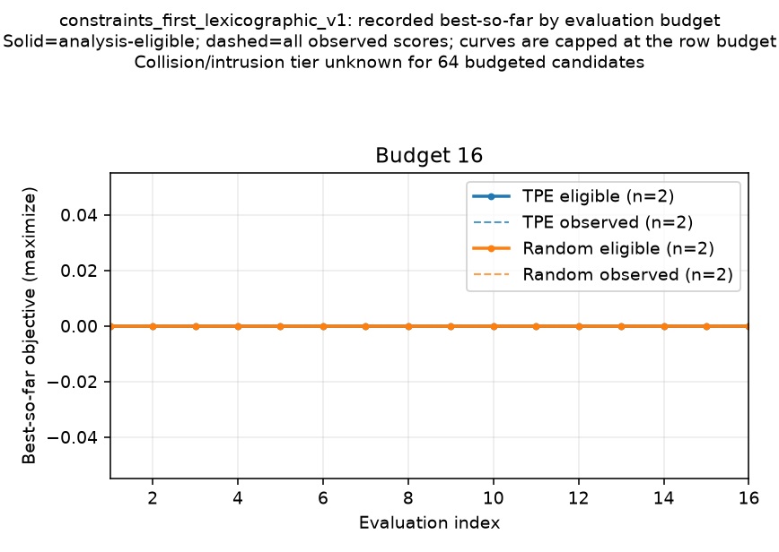

# Falsification search convergence report

This diagnostic report summarizes persisted search attempts and their best-so-far objective by evaluation budget.

- Claim scope: `diagnostic_only_finite_search_budget`.
- Comparison input SHA-256: `7c8e7d0f6c74cef38bc776d24d19737176eb9eaebcac99ff1a91faeda302e02d`.
- Archived manifest path map: `docs/context/evidence/issue_9645_bounded_falsification_2026-09-24/payload/reproduction_inputs/pilot_report_manifest_path_map.v1.json`; SHA-256 `1a8cf3b763e562a8febe0d946c2db34cdcc9cbe8a183117c50d3f1c91da45ae7`; bound comparison SHA-256 `7c8e7d0f6c74cef38bc776d24d19737176eb9eaebcac99ff1a91faeda302e02d`.
- Source revision status: `consistent`.
- Exact source revision: `58e516aa4f69ff3098bf518199f483006589758c`.

## Per-run accounting

| Objective | Method | Seed | Budget | Search runtime (s) | Best observed ≤B | Best eligible ≤B | Analysis evidence: eligible / ineligible (≤B) | Criticality: critical / not-critical / unknown (≤B) | Collision/intrusion tier: critical / not-critical / unknown (≤B) | Known critical (all rows) | Eligible critical ≤B | First eligible critical eval | Over-budget rows | Valid / invalid / failed / scoreless / missing ≤B / all expected | Duplicates ≤B | Execution modes | Availability | Run input status | Artifact |
|---|---:|---:|---:|---:|---:|---:|---|---|---|---:|---:|---:|---:|---:|---:|---|---|---|---|
| `constraints_first_lexicographic_v1` | Random | 1101 | 16 | Not recorded | 0 | 0 | 16 / 0 | 0 / 0 / 16 | 0 / 0 / 16 | 0 | 0 | None recorded | 0 | 16 / 0 / 0 / 0 / 0 / 0 | 0/16 | native: 16 | available: 16 | input checks passed | available |
| `constraints_first_lexicographic_v1` | TPE | 1101 | 16 | Not recorded | 0 | 0 | 16 / 0 | 0 / 0 / 16 | 0 / 0 / 16 | 0 | 0 | None recorded | 0 | 16 / 0 / 0 / 0 / 0 / 0 | 0/16 | native: 16 | available: 16 | input checks passed | available |
| `constraints_first_lexicographic_v1` | Random | 2202 | 16 | Not recorded | 0 | 0 | 16 / 0 | 0 / 0 / 16 | 0 / 0 / 16 | 0 | 0 | None recorded | 0 | 16 / 0 / 0 / 0 / 0 / 0 | 0/16 | native: 16 | available: 16 | input checks passed | available |
| `constraints_first_lexicographic_v1` | TPE | 2202 | 16 | Not recorded | 0 | 0 | 16 / 0 | 0 / 0 / 16 | 0 / 0 / 16 | 0 | 0 | None recorded | 0 | 16 / 0 / 0 / 0 / 0 / 0 | 0/16 | native: 16 | available: 16 | input checks passed | available |

Budget-limited summaries use only the first B comparison-indexed candidate rows. Extra rows remain in JSON audit history and cannot alter best-so-far values or paired deltas.

Analysis-evidence counts apply the report's canonical eligibility checks to each parseable, byte-verified episode-record artifact and retain the producer's `analysis_eligibility` receipt separately in JSON. These counts do not indicate detailed simulation-step or planner-decision traces, and they do not establish safety-tier completeness. Criticality columns report known critical, known non-critical, and unknown candidate counts separately. Collision/severe-intrusion tier counts require explicit evidence for both components to report `not_critical`; a missing, malformed, or contradictory component remains `unknown`.

Eligible best/critical summaries require a scored objective, `execution_mode=native`, `readiness_status=native`, `availability_status=available`, a parseable episode-record artifact, an effective-scenario hash, and an explicit `analysis_eligibility.eligible=true` receipt; contradictory or incomplete evidence stays ineligible. Per-evaluation reason codes identify failed checks.

Valid candidates within B are derived as `candidate rows within B - invalid - failed`; scoreless valid evaluations remain in that count. Missing and over-budget attempts remain explicit.

## Matched Random vs TPE

| Objective | Budget | Matched eligible seeds | Excluded matched seeds | TPE − Random median | Observed delta range | Inference |
|---|---:|---:|---:|---:|---:|---|
| `constraints_first_lexicographic_v1` | 16 | 2 | 0 | 0 | 0 to 0 | Not performed; descriptive only |

Run input status reports per-run index/manifest/config checks only; it does not assert that a Random/TPE pair exists or qualifies. Pairs are decided separately and require index/manifest agreement, matching normalized scenario/search/planner configuration, no over-budget rows, complete budgeted evaluations, and an analysis-eligible score from both methods. Missing, unmatched, ambiguous, and counterpart-ineligible cases remain in the JSON with reason codes.

## Figures

## Interpretation limits

- A finite search budget that finds no counterexample does not establish that none exists.
- Seed/run aggregates are descriptive; observed min/max ranges are not confidence intervals.
- No inferential test is performed, and small pilot seed counts do not support broad claims.
- Search-level runtime is reported only when a finite nonnegative runtime_seconds field is recorded in the search manifest or its summary; comparison-row fields are ignored.
- The current runner's legacy num_valid_candidates summary omits evaluator failures; this report derives valid as candidate rows minus invalid minus failed and retains the legacy field for audit.
- A recorded successful outcome or zero historical v1 score does not establish a negative collision/severe-intrusion tier when either component is absent or contradictory; the report preserves that tier as unknown.
- Fixture tests verify report accounting; finite-budget reports do not establish planner safety, search-space coverage, or absence of counterexamples.

## Provenance

Comparison artifact: `docs/context/evidence/issue_9645_bounded_falsification_2026-09-24/payload/pilot_comparison.json`.

- `random:1101:16:constraints_first_lexicographic_v1:row1`: declared `output/issue9645-pilot/results/constraints_first_lexicographic_v1/budget_0016/seed_1101/random/manifest.json`; archived `docs/context/evidence/issue_9645_bounded_falsification_2026-09-24/payload/reproduction_inputs/manifests/random_seed_1101.json`; SHA-256 `2b40ddabdc64dc7f6d35974a96b36db15e6894e1e5e582796c9e1fd17bf4b92e`; config SHA-256 `f174f22672aa05d222f7ce6bb20ecf64a042fb73dca9449dbaf7c44dc3e4ec38`; status `available`.
  Mapping provenance: `docs/context/evidence/issue_9645_bounded_falsification_2026-09-24/payload/reproduction_inputs/pilot_report_manifest_path_map.v1.json`; path-map SHA-256 `1a8cf3b763e562a8febe0d946c2db34cdcc9cbe8a183117c50d3f1c91da45ae7`; archived SHA-256 `2b40ddabdc64dc7f6d35974a96b36db15e6894e1e5e582796c9e1fd17bf4b92e`.
- `optuna:1101:16:constraints_first_lexicographic_v1:row2`: declared `output/issue9645-pilot/results/constraints_first_lexicographic_v1/budget_0016/seed_1101/optuna/manifest.json`; archived `docs/context/evidence/issue_9645_bounded_falsification_2026-09-24/payload/reproduction_inputs/manifests/tpe_seed_1101.json`; SHA-256 `51f7dcf82d9e75a7156356d4465820cfe962a1208dd0c0ec38372031170c3aa5`; config SHA-256 `a3e0978a698fa7d3696c101203b39a15702447906249e46f77d80ca2c7b9e6ea`; status `available`.
  Mapping provenance: `docs/context/evidence/issue_9645_bounded_falsification_2026-09-24/payload/reproduction_inputs/pilot_report_manifest_path_map.v1.json`; path-map SHA-256 `1a8cf3b763e562a8febe0d946c2db34cdcc9cbe8a183117c50d3f1c91da45ae7`; archived SHA-256 `51f7dcf82d9e75a7156356d4465820cfe962a1208dd0c0ec38372031170c3aa5`.
- `random:2202:16:constraints_first_lexicographic_v1:row3`: declared `output/issue9645-pilot/results/constraints_first_lexicographic_v1/budget_0016/seed_2202/random/manifest.json`; archived `docs/context/evidence/issue_9645_bounded_falsification_2026-09-24/payload/reproduction_inputs/manifests/random_seed_2202.json`; SHA-256 `8d0d0cac1644befdf6726555e2547359bf43b832cc95d754becf9dd2acc656ac`; config SHA-256 `84de14ba637674502970acd646e915dcc27b85ce454a897beb540af6e8e44162`; status `available`.
  Mapping provenance: `docs/context/evidence/issue_9645_bounded_falsification_2026-09-24/payload/reproduction_inputs/pilot_report_manifest_path_map.v1.json`; path-map SHA-256 `1a8cf3b763e562a8febe0d946c2db34cdcc9cbe8a183117c50d3f1c91da45ae7`; archived SHA-256 `8d0d0cac1644befdf6726555e2547359bf43b832cc95d754becf9dd2acc656ac`.
- `optuna:2202:16:constraints_first_lexicographic_v1:row4`: declared `output/issue9645-pilot/results/constraints_first_lexicographic_v1/budget_0016/seed_2202/optuna/manifest.json`; archived `docs/context/evidence/issue_9645_bounded_falsification_2026-09-24/payload/reproduction_inputs/manifests/tpe_seed_2202.json`; SHA-256 `7b4af9ea0efbc2dc5ee7f58f27ecae10ab0af285644c70ddc4ff17817b07d1bf`; config SHA-256 `7d91ed1a1a7c319bcba735813152b19ab1b202d018b7b4322fbe9e2261663e75`; status `available`.
  Mapping provenance: `docs/context/evidence/issue_9645_bounded_falsification_2026-09-24/payload/reproduction_inputs/pilot_report_manifest_path_map.v1.json`; path-map SHA-256 `1a8cf3b763e562a8febe0d946c2db34cdcc9cbe8a183117c50d3f1c91da45ae7`; archived SHA-256 `7b4af9ea0efbc2dc5ee7f58f27ecae10ab0af285644c70ddc4ff17817b07d1bf`.
