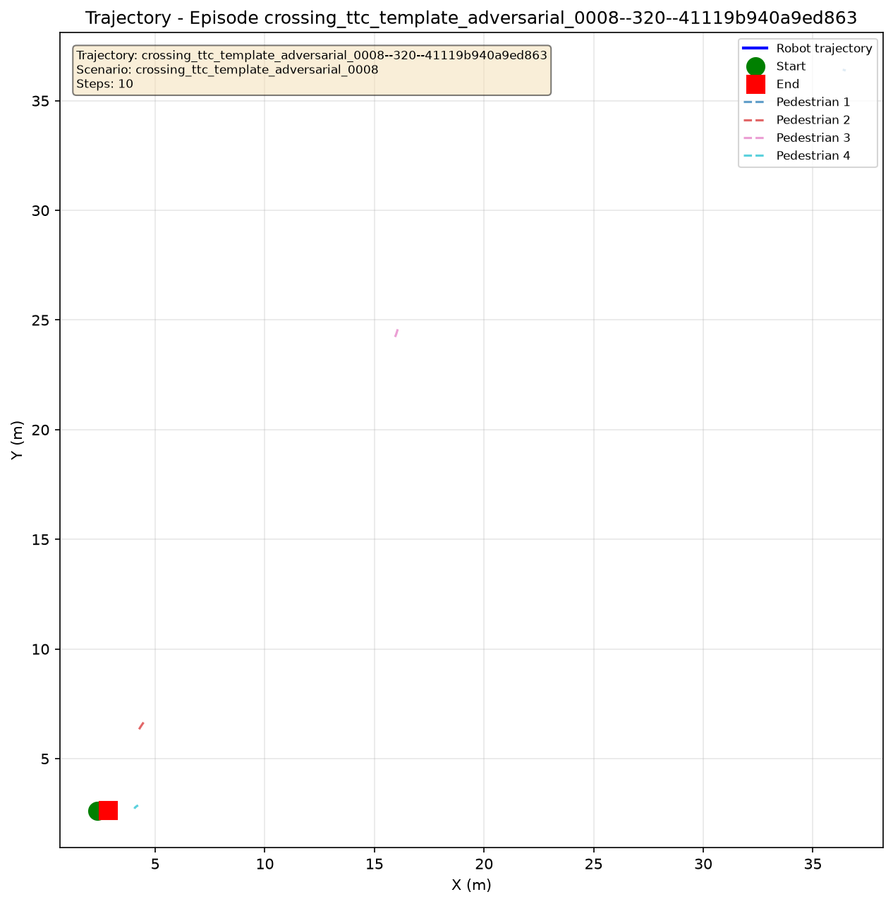
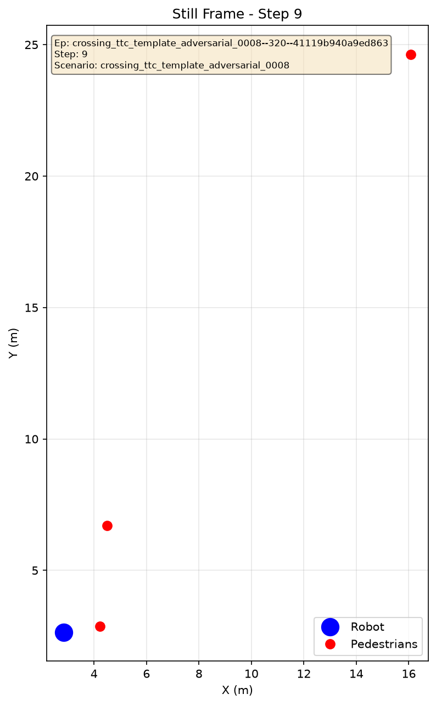
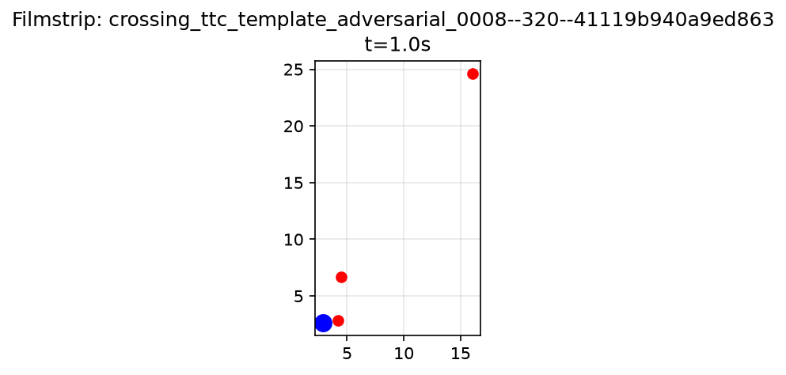

<!-- AI-GENERATED (robot_sf#9647, 2026-09-25) - NEEDS-REVIEW -->
# #9647 strict-certificate replay gallery smoke

This one-case run exercises the documented gallery CLI with the current canonical certificate
schema and route-aggregation gate. It uses the tracked #1501 `failure_0002` compatibility fixture,
not a persisted search result or new discovery.

- Code revision: `4ad36ecae489eea9e6461932a0b208a58ee27663` (clean at execution).
- Command: `scripts/dev/run_worktree_shared_venv.sh -- uv run python scripts/tools/materialize_adversarial_replay_gallery.py tests/fixtures/adversarial_replay_gallery/issue_1501_compat/manifest.json --out output/adversarial-replay-gallery/issue9647_strict_certificate_smoke_4ad36ec --top-k 1`
- Budget: one historical fixture row represented; one case selected and replayed; no new search
  candidate or held-out episode.
- Replay: identity, collision outcome/failure attribution, and the
  `constraints_first_lexicographic_v1` objective matched. Status is
  `outcome_reproduced_revision_changed` because the replay code revision differs from the historical
  episode revision `58e516aa4f69ff3098bf518199f483006589758c`.
- Source input binding remains **unknown** because the historical episode does not attest the map
  registry digest. The scenario, route overrides, current map registry, and map bytes used to create
  the post-hoc certificate have recorded digests in
  `tests/fixtures/adversarial_replay_gallery/issue_1501_compat/scenario_certification_provenance.json`.
- The fixture certificate is a post-hoc canonical static-route result (`hard_but_solvable`),
  generated at `a468f1960278afb0896145221af105648bb3965f`. It is not an original
  search-time certificate. Dynamic task feasibility remains **unknown**.
- Rendering produced trajectory, still, and filmstrip figures. Map overlay is unavailable because
  the renderer cannot decode the source SVG; video is unavailable because the canonical runner
  emitted no video artifact. The renderer split one discontinuous actor track.

The replay output, raw episode streams, and case manifests remain in ignored local `output/`.
This receipt records their hashes without promoting those files. This smoke is selector, replay,
and rendering plumbing evidence only; it does not establish dynamic feasibility, planner
performance, a new counterexample, or real-world safety.

