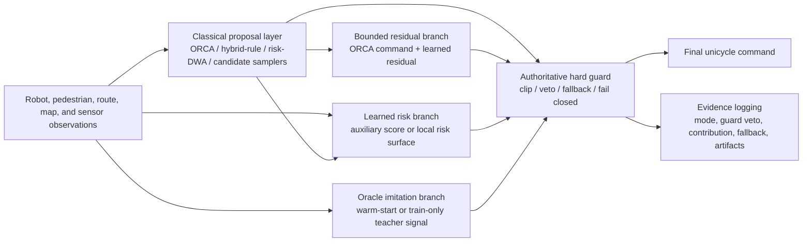
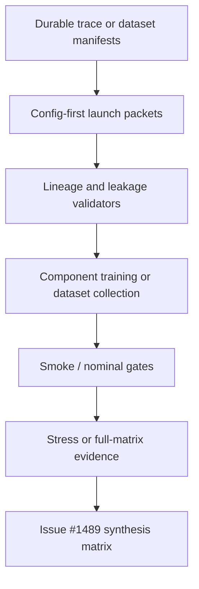

# Issue #1624 Hybrid-Learning Navigation Architecture

Date: 2026-05-30

Related issue: <https://github.com/ll7/robot_sf_ll7/issues/1624>

## Scope

This note proposes the current Robot SF architecture for hard-guarded hybrid-learning local
navigation. It is a design and synthesis scaffold, not a benchmark result, training run, or
paper-facing performance claim.

The architecture connects the existing ORCA-residual, learned-risk, oracle-imitation, and
shielded-PPO lanes under one rule: learned components may propose, rank, warm-start, or boundedly
repair actions, but the hard guard remains authoritative. Fallback, degraded, failed, and
`not_available` execution modes stay caveats or exclusions under
`docs/context/issue_691_benchmark_fallback_policy.md`.

## Proposed Runtime Shape



The preferred default stack is:

1. A classical proposal layer produces the nominal local command and comparable candidate actions.
2. Learned components operate through declared auxiliary interfaces:
   - bounded ORCA residuals adjust the ORCA command within explicit residual limits,
   - learned risk contributes a cost, risk surface, or ranking signal,
   - oracle imitation provides train-time labels or a later guarded warm-start candidate,
   - shielded PPO repair changes only the declared repair hypothesis and stays under the runtime
     guard.
3. The hard guard clips, vetoes, substitutes, or rejects unsafe proposals before the final command.
4. The benchmark/evidence layer records the intended component contribution and whether execution
   was native, adapter-backed, guarded, fallback, degraded, failed, or unavailable.

## Training And Evidence Flow



Launch packets and validators are necessary gates, but they do not prove navigation improvement.
Issue #1489 should consume rows only after component campaigns produce durable stress or
full-matrix evidence that passes the schema in `docs/context/issue_1499_hybrid_evidence_matrix_schema.md`.

## Component Map

| Mechanism | Source issue | Current state | Architecture role | Evidence boundary |
| --- | --- | --- | --- | --- |
| ORCA / classical local planner | #1358, #1475 | Implemented as the baseline proposal family for the residual lane | Nominal command and comparator | Classical execution can be evidence when the benchmark run is native/adapter-valid; residual claims still need trained residual evidence. |
| Bounded ORCA residual | #1358, #1475 | Planned/staged through the ORCA-residual BC lineage packet | Learned adjustment over an ORCA command | Existing smoke/runtime wiring is not enough to claim a learned residual improves navigation. |
| Learned risk model | #1395, #1472 | Launch packet/staged | Auxiliary cost, scorer, or risk surface that informs candidate selection | Hard guards remain authoritative; launch-packet validation is not campaign evidence. |
| Shielded PPO repair | #1396, #1474 | Launch packet/staged | Narrow repair of a guarded PPO baseline under one reward delta | Any improvement must separate raw PPO behavior, guard vetoes, fallback, and final guarded actions. |
| Oracle imitation | #1397, #1470 | Dataset packet prepared; future collection/training remains separate | Train-time teacher signal or future guarded warm-start | Oracle trajectories and relabeling are train-only unless a later adapter proves deployment-safe inputs. |
| Learned local-policy adapter fixture | #1618, #1685 | Implemented as a deterministic fixture boundary | Adapter contract smoke for future learned policies | Fixture-only; not a promoted candidate or performance result. |
| Learned risk-surface interface | #1675 | Implemented as deterministic producer/adapter smoke | Local risk-field contract for planners that consume occupancy-style risk | Interface proof only; no learned checkpoint or benchmark-strength claim. |
| Hybrid evidence matrix | #1499, #1489 | Schema exists; synthesis blocked on component outputs | Common comparison contract | Rows with `launch_packet`, `smoke_only`, `fallback`, `degraded`, `failed`, or `not_available` tiers are excluded from comparative synthesis. |

## Evidence Synthesis Table

| Mechanism | Source issue | Evidence tier | Config | Seeds | Artifacts | Metrics | Verdict | Caveats |
| --- | --- | --- | --- | --- | --- | --- | --- | --- |
| ORCA-residual BC | #1475 / #1358 | `launch_packet` / staged | `configs/training/orca_residual/orca_residual_bc_issue_1428.yaml` | Packet-defined; campaign not run here | `docs/context/policy_search/SLURM/005_orca_residual_bc_lineage.md` and lineage diagnostics | Required: ORCA command, raw residual, bounded residual, guarded command, residual clipping, guard veto/fallback | `pending` | Not synthesis-eligible until smoke/nominal and later stress/full evidence exists with durable outputs. |
| Learned risk model v1 | #1472 / #1395 | `launch_packet` | `configs/training/learned_risk_model_issue_1395_launch_packet.yaml` | `111`, `112`, `113` in the frozen packet | `docs/context/issue_1395_learned_risk_launch_packet.md` | Required: learned risk score, hard-guard decision, auxiliary cost weight, outcome labels | `pending` | Auxiliary only; cannot replace the hard guard or count preflight stubs as evidence. |
| Shielded PPO repair | #1474 / #1396 | `launch_packet` | `configs/training/shielded_ppo_issue_1396_launch_packet.yaml` | `111`, `112`, `113` in the frozen packet | `docs/context/issue_1396_shielded_ppo_launch_packet.md` | Required: raw PPO action, guarded action, guard veto/fallback, stop gates | `pending` | One repair hypothesis only; gains dominated by guard saturation should be rejected or revised. |
| Oracle imitation dataset | #1470 / #1397 | `launch_packet` / dataset-prep | `configs/training/ppo_imitation/oracle_dataset_issue_1397_launch_packet.yaml` | Split-policy controlled | `docs/context/policy_search/SLURM/003_imitation_oracle_dataset_campaign.md` and split contract | Required: split overlap, hard-slice assignment, relabeling scope, checksums, artifact pointers | `pending` | Dataset collection and imitation training remain separate; oracle/future fields are forbidden at deployment. |
| Learned adapter fixture | #1618 / #1685 | `adapter_fixture_only` | None; deterministic fixture | Not applicable | `docs/context/issue_1685_dummy_learned_policy_adapter.md` | Contract checks only | `continue` as an interface fixture | Not a learned model, registry candidate, benchmark row, or paper claim. |
| Learned risk surface | #1675 | `interface_smoke` | None; deterministic fixture | Not applicable | `docs/context/issue_1675_learned_risk_surface_interface.md` | Surface shape, normalization, fail-closed adapter diagnostics | `continue` as an interface | No learned producer, model provenance, or benchmark comparison exists yet. |

## Implemented, Planned, Speculative, Rejected

Implemented now:

- Hard-guard and fallback vocabulary across benchmark notes.
- Hybrid evidence matrix schema for future #1489 synthesis.
- Deterministic learned-policy adapter fixture for contract testing.
- Deterministic learned risk-surface interface smoke.
- Launch packets for learned risk, shielded PPO repair, ORCA-residual BC, and oracle imitation.

Planned or staged:

- Execute #1475 ORCA-residual BC through smoke/nominal gates before broader evaluation.
- Execute #1472 learned-risk and #1474 shielded-PPO campaigns only after their launch packets are
  tied to exact branch/commit and durable artifact pointers.
- Promote only rows that satisfy the #1499 matrix schema and the fallback policy.

Speculative:

- A single runtime arbiter that combines residual, learned risk, imitation warm-start, and shielded
  repair in one policy stack.
- Comparative hybrid-learning manuscript claims.
- Any claim that learned components improve downstream navigation rather than only intermediate
  diagnostics.

Rejected for the current scope:

- Unguarded learned-policy replacement of the local planner.
- Counting fallback, degraded, failed, or `not_available` execution as successful benchmark
  evidence.
- Broad architecture sweeps before the first component campaign produces durable evidence.
- Using oracle/future trajectory fields as deployment-time policy inputs.

## Recommended Follow-Up Boundary

No new GitHub issue is needed from this note. The concrete execution lanes already exist:

- Issue #1475 / Issue #1358 for bounded ORCA-residual evidence,
- Issue #1472 / Issue #1395 for learned-risk execution,
- Issue #1474 / Issue #1396 for shielded-PPO repair,
- Issue #1470 / Issue #1397 for oracle-imitation dataset execution,
- Issue #1489 for synthesis after at least two comparable component campaigns have durable outputs.

If future work discovers a missing adapter or report generator, open it only after a component
campaign produces a concrete artifact shape that existing tooling cannot summarize.

## Validation

This issue changes documentation only. The validation path is:

```bash
BASE_REF=origin/main scripts/dev/check_docs_proof_consistency_diff.sh
git diff --check origin/main...HEAD
```

The proof standard is path and issue traceability plus explicit non-claim boundaries; no benchmark
or training evidence is produced by this note.
