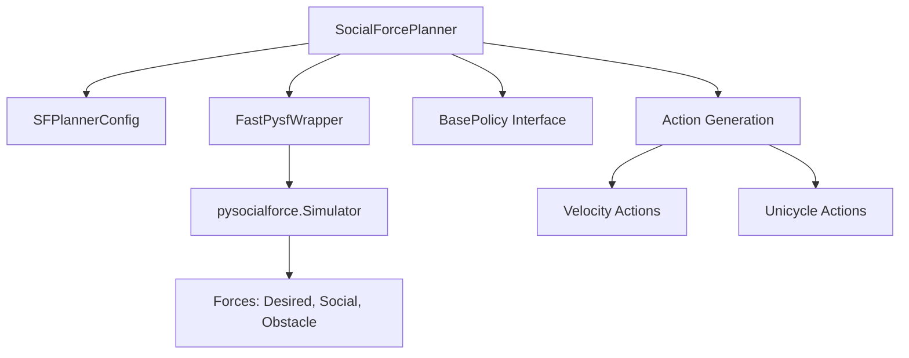

# Social Force Wrapper Design Document

## Overview

This document describes the design and implementation of the Social Force planner wrapper for the Social Navigation Benchmark. The wrapper provides a standardized interface to the Social Force model from the `fast-pysf` library, enabling its use as a baseline algorithm in benchmark evaluations.

## Goals and Non-Goals

### Goals
- Provide a reproducible, configurable Social Force planner compatible with the benchmark harness
- Support both velocity `(vx, vy)` and unicycle `(v, ω)` action spaces
- Ensure deterministic behavior when seeded for reproducible benchmarking
- Integrate seamlessly with existing CLI and Python API
- Produce schema-compliant episode outputs with proper metadata

### Non-Goals
- Implementation of advanced Social Force variants (e.g., group forces beyond basic configuration)
- ORCA/RVO integration (separate baseline)
- Multi-robot coordination beyond single-agent planning
- Real-time performance optimization (focus on correctness and reproducibility)

## Architecture

### Core Components



### Class Hierarchy

- `BasePolicy` (abstract interface)
  - `SocialForcePlanner` (concrete implementation)

### Key Data Structures

- `SFPlannerConfig`: Configuration dataclass with all tunable parameters
- `Observation`: Input observation containing robot state, agents, and obstacles
- `Action`: Output action dict with velocity or unicycle commands

## Interface Specification

### Public API

```python
class SocialForcePlanner(BasePolicy):
    def __init__(self, config: Union[Dict, SFPlannerConfig], *, seed: Optional[int] = None)
    def reset(self, *, seed: Optional[int] = None) -> None
    def configure(self, config: Union[Dict, SFPlannerConfig]) -> None
    def step(self, obs: Union[Observation, Dict]) -> Dict[str, float]
    def close(self) -> None
    def get_metadata(self) -> Dict[str, Any]
```

### Input Observation Schema

```python
{
    "dt": float,  # Integration timestep [s]
    "robot": {
        "position": [x, y],      # Robot position [m]
        "velocity": [vx, vy],    # Robot velocity [m/s]
        "goal": [gx, gy],        # Goal position [m]
        "radius": float          # Robot radius [m]
    },
    "agents": [  # List of pedestrians/agents
        {
            "position": [x, y],
            "velocity": [vx, vy],
            "radius": float
        }
    ],
    "obstacles": []  # Optional: list of static obstacles
}
```

### Output Action Schema

**Velocity Mode:**
```python
{"vx": float, "vy": float}  # Velocity commands [m/s]
```

**Unicycle Mode:**
```python
{"v": float, "omega": float}  # Linear and angular velocity [m/s, rad/s]
```

## Social Force Model Implementation

### Force Equations

The Social Force model computes the total force on an agent as:

```
F_total = F_desired + F_social + F_obstacle
```

**Desired Force (Goal Attraction):**
```
F_desired = (v_desired - v_current) / τ
```

**Social Force (Agent Repulsion):**
```
F_social = A * exp((r_ij - d_ij) / B) * n_ij * λ_ij
```

**Obstacle Force (Wall Repulsion):**
```
F_obstacle = A_obs * exp((r_i - d_iw) / B_obs) * n_iw
```

Where:
- `τ`: relaxation time
- `A, B`: social force parameters
- `A_obs, B_obs`: obstacle force parameters
- `λ_ij`: anisotropy factor
- `r_ij`: sum of radii
- `d_ij`: distance between agents
- `n_ij`: unit vector from j to i

### Implementation Details

The wrapper uses the `FastPysfWrapper` class to interface with the `pysocialforce` library:

1. **Setup**: Creates a minimal `pysocialforce.Simulator` instance with pedestrian states
2. **Force Computation**: Uses `wrapper.get_forces_at()` to compute forces at robot position
3. **Action Generation**: Converts forces to velocity or unicycle actions based on configuration

## Configuration System

### Parameter Categories

**Kinematics:**
- `mode`: Control mode ("velocity" or "unicycle")
- `v_max`, `omega_max`: Maximum velocities
- `dt`: Integration timestep

**Goal Dynamics:**
- `desired_speed`: Preferred movement speed
- `tau`: Relaxation time for desired force

**Interaction Forces:**
- `A`, `B`: Social force amplitude and range
- `lambda_anisotropy`: Forward/backward asymmetry
- `cutoff_radius`: Maximum interaction distance

**Obstacle Forces:**
- `A_obs`, `B_obs`: Obstacle force parameters

**Numerics:**
- `integration`: Integration method
- `clip_force`: Force magnitude limiting
- `max_force`: Maximum force threshold

**Stochasticity:**
- `noise_std`: Force noise standard deviation

### Default Configuration

The default configuration provides sensible parameters for general scenarios:
- Conservative force parameters to avoid oscillations
- Moderate speed limits for safety
- No noise for deterministic behavior
- Velocity action space for simplicity

## Determinism and Reproducibility

### Seeding Strategy

- Random number generator (`np.random.RandomState`) is seeded during initialization
- `reset(seed=N)` allows re-seeding for different episodes
- All stochastic behavior (noise injection) uses the seeded RNG

### Deterministic Guarantees

When `noise_std = 0`:
- Same observation → same action (bitwise identical)
- Same seed + observation sequence → identical trajectory
- Platform-independent results (NumPy operations only)

## Action Space Conversion

### Velocity Actions

Forces are converted to velocity commands using Social Force dynamics:
```python
v_desired = v_current + F_total * τ
action = {"vx": v_desired[0], "vy": v_desired[1]}
```

### Unicycle Actions

Forces are converted to unicycle commands using heading control:
```python
desired_heading = atan2(F_total[1], F_total[0])
omega = (desired_heading - current_heading) / dt
v = min(desired_speed, |F_total| * scale_factor)
action = {"v": v, "omega": omega}
```

## Safety and Constraints

### Velocity Limiting

When `safety_clamp = True`:
- Linear velocity clamped to `[0, v_max]`
- Angular velocity clamped to `[-omega_max, omega_max]`
- Force magnitude limited by `max_force` parameter

### Numerical Stability

- Force clipping prevents numerical instability from very large forces
- Small epsilon values prevent division by zero
- Graceful handling of edge cases (empty agent lists, coincident positions)

## Integration Points

### Baseline Registry

The planner is registered in `robot_sf.baselines.BASELINES`:
```python
BASELINES = {
    "baseline_sf": SocialForcePlanner,
}
```

### CLI Integration

Supports the benchmark CLI via:
```bash
robot_sf_bench run --matrix scenarios.yaml --algo baseline_sf --out results.jsonl
```

### Episode Output

The planner provides metadata for episode records:
```python
{
    "algorithm": "social_force",
    "config": {...},  # Full configuration dict
    "config_hash": "abc123...",  # 16-char deterministic hash
}
```

## Error Handling and Edge Cases

### Robustness Measures

- **Empty agent lists**: Handled gracefully (no social forces)
- **Coincident positions**: Small epsilon prevents division by zero
- **Missing pysocialforce**: Descriptive error messages
- **Invalid configurations**: Parameter validation with clear errors

### Degradation Strategies

- Force computation failures fall back to desired force only
- Missing observation fields use sensible defaults
- Configuration errors provide helpful diagnostics

## Performance Considerations

### Computational Complexity

- **Force computation**: O(N) where N = number of agents
- **Interaction cutoff**: Reduces effective N for distant agents
- **Per-step overhead**: Minimal (single force query per step)

### Memory Usage

- Minimal state maintained between steps
- Simulator instance reused when possible
- No large data structure allocations per step

## Testing Strategy

### Unit Tests

- Configuration validation and parsing
- Force-to-action conversion correctness
- Determinism verification (same seed → same output)
- Safety constraint enforcement
- Edge case handling

### Integration Tests

- End-to-end scenario completion
- Pedestrian avoidance behavior
- Goal reaching in obstacle-free environments
- Action space compatibility (velocity vs unicycle)
- Configuration loading from YAML

### Smoke Tests

- Baseline registry integration
- CLI compatibility (when implemented)
- Episode schema compliance
- Metadata generation

## Future Extensions

### Potential Enhancements

- **Advanced force models**: Group forces, curved paths
- **Dynamic obstacles**: Moving barrier avoidance
- **Multi-agent coordination**: Consideration of other robots
- **Performance optimization**: Vectorized force computation
- **Parameter adaptation**: Learning-based tuning

### API Stability

The current interface is designed to be forward-compatible:
- Additional configuration parameters can be added with defaults
- New observation fields can be optional
- Action space extensions (e.g., acceleration) can be supported

## References

1. Helbing, D., & Molnár, P. (1995). Social force model for pedestrian dynamics. Physical Review E, 51(4), 4282.
2. Moussaïd, M., et al. (2010). The walking behaviour of pedestrian social groups and its impact on crowd dynamics. PLoS ONE, 5(4), e10047.
3. PySocialForce Library: https://github.com/yuxiang-gao/PySocialForce
4. Social Navigation Benchmark Specification (internal)