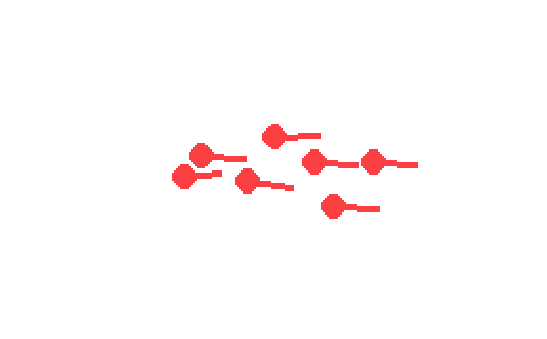

# robot-sf

## NPC Pedestrians

This file explains how NPC pedestrians behave, what aspects are important, and how to configure them.

In the simulation view, they are represented as red dots with a line indicating their velocity and direction.

### About

The NPC pedestrians use the Extended Social Force Model [[2]](#2).
It extends the vanilla social force model [[1]](#1) to simulate the walking behavior
of pedestrians with social group interactions.

Implementations, which they are based off, are [[3]](#3) and [[4]](#4).

### Forces

The forces are divided into 3 categories:

- Classical: The classic social force model by [[1]](#1)
- Extended: The extended model by [[3]](#3)
- New: Newly implemented forces for this simulation

All forces are summed up in the end to determine the direction and the velocity.

#### Classical

*Located in the [forces.py](../../fast-pysf/pysocialforce/forces.py) file.*

Desired Force:  
This force describes the pedestrian's wish to reach a goal and is also called the acceleration force.  
It tries to accelerate the pedestrian in the right direction, if the pedestrian is moving towards the target at maximum speed, the force is zero.
When the destination is reached, a braking force is applied depending on the current velocity.

Social Force:  
This force represents the influence of other npc pedestrians in a specific radius.  
It tries to repel based on position, direction and velocity differences, decaying exponentially.

Obstacle Force:  
This repulsive force is used to avoid immovable obstacles such as walls.
It uses the distance to the nearest point of the obstacle to calculate its strength.

#### Extended

*Located in the [forces.py](../../fast-pysf/pysocialforce/forces.py) file.*

Group Repulsive Force:  
This force models repulsive interactions between members of a group, by summing up the relative position vectors of nearby members.

Group Coherence Force:  
This force aims to keep the members of the group together by pointing towards the centroid of the group.

Group Gaze Force:  
This force aligns the pedestrian with the members direction.

#### New

*Located in the [ped_robot_force.py](../../robot_sf/ped_npc/ped_robot_force.py) file.*

Ped-Robot Force:  
This force is repulsive and causes pedestrians to avoid the robot.

### Behaviors

*Located in the [ped_behavior.py](../../robot_sf/ped_npc/ped_behavior.py) file.*

FollowRouteBehavior:  
Pedestrians follow a fixed route and restart at the spawn when the route is finished.
When this happens, the pedestrian starts a new trajectory, even though the ID is the same.

CrowdedZoneBehavior:  
Pedestrians try to reach a goal in a predefined zone, and when they reach it, they are redirected to a new goal within the zone without respawning at a different location.

### Configuration

(The most important ones)

*Located in the [sim_config.py](../../robot_sf/sim/sim_config.py) file.*

- base configuration for the simulation
- e.g. pedestrian_radius = 0.4, peds_speed_mult = 1.3 (max_speed_multiplier)

*Located in the fast-pysf [config.py](../../fast-pysf/pysocialforce/config.py) file.*

- base configuration for all the forces
- if group forces should be used

*Located in the [ped_population.py](../../robot_sf/ped_npc/ped_population.py) file.*

- sidewalk_width: float = 3.0 -> Determines deviation at spawn
- initial_speed: float = 0.5, with the max_speed_multiplier it leads to a maximum speed of 0.65 m/s (~2.34 km/h)

### References

<a id="1">[1]</a> Helbing, D., & Molnár, P. (1995). Social force model
for pedestrian dynamics. Physical Review E, 51(5), 4282–4286.
<https://doi.org/10.1103/PhysRevE.51.4282>

<a id="2">[2]</a> Moussaïd, M., Perozo, N., Garnier, S., Helbing, D., & Theraulaz, G. (2010).
The walking behaviour of pedestrian social groups and its impact on crowd dynamics.
PLoS ONE, 5(4), 1–7. <https://doi.org/10.1371/journal.pone.0010047>

<a id="3">[3]</a> Sven Kreiss's original Social Force implementation
on [GitHub](https://github.com/svenkreiss/socialforce)

<a id="4">[4]</a> Python Implementation of the Extended Social Force Model for Pedestrian Dynamics on [GitHub](https://github.com/yuxiang-gao/PySocialForce)