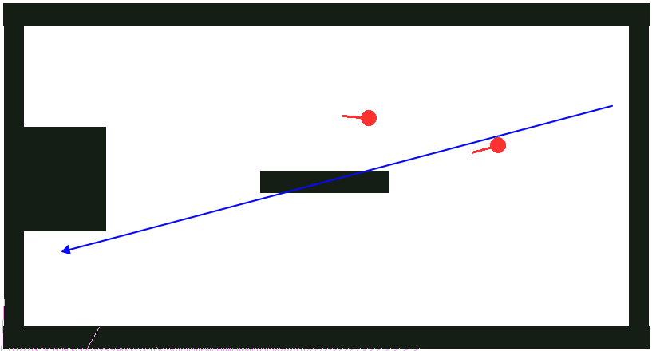
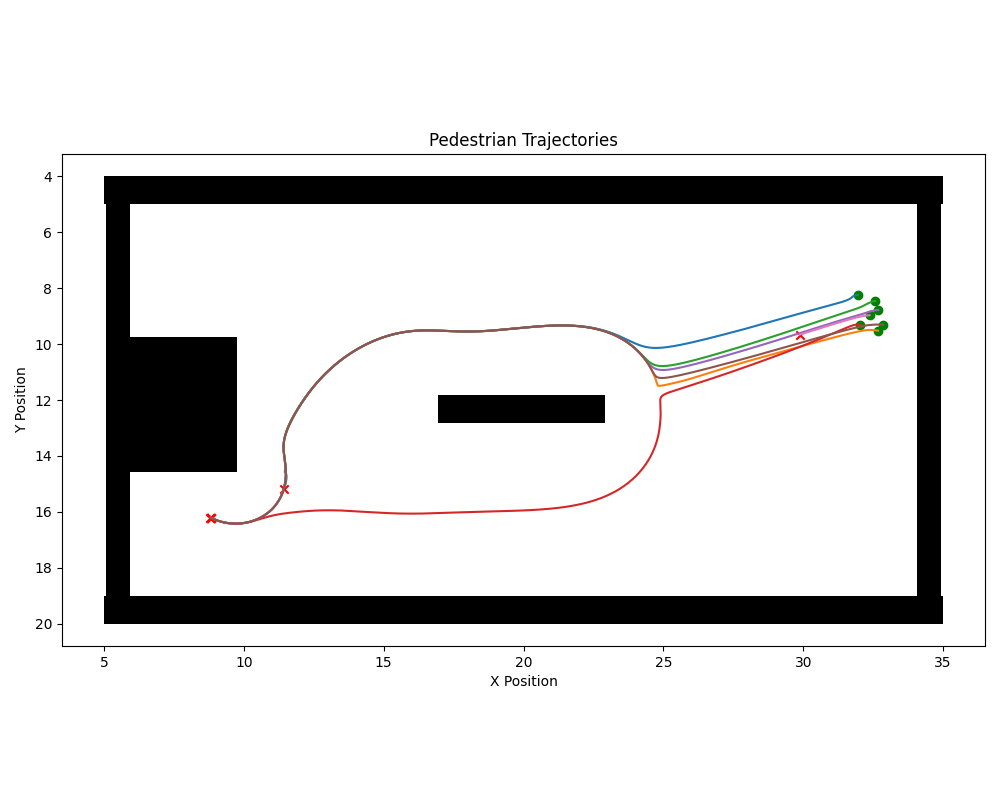
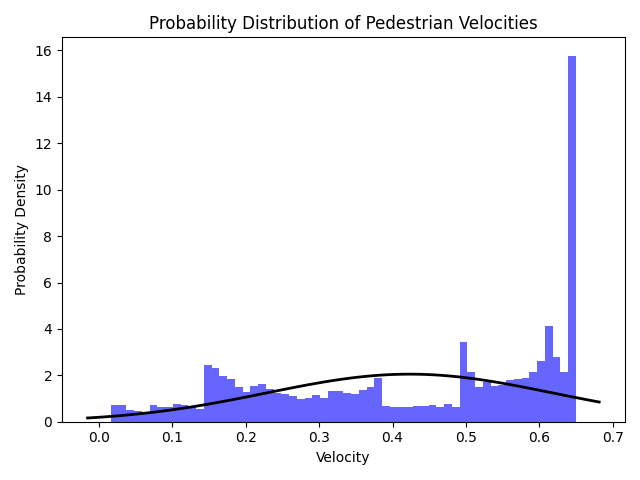
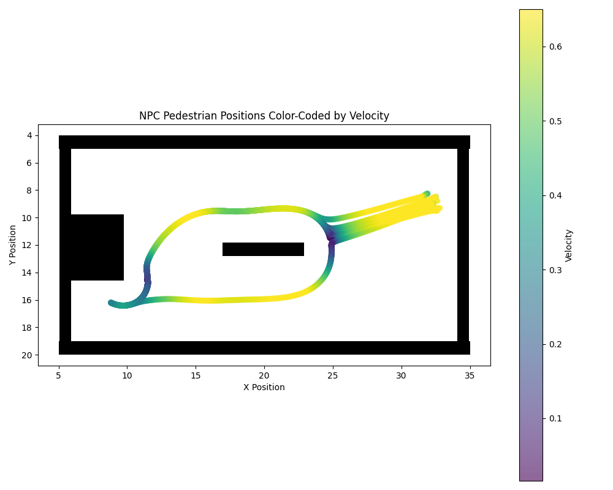

# robot-sf

## Pedestrian metrics analysis

The main focus of this file is to analyze which methods have been used by different papers to validate pedestrian behavior.

### [Paper 1](#1)

Link to [GitHub](https://github.com/c-pouw/physics-based-pedestrian-modeling)

The authors of this paper validate their newly created pedestrian model with following methods:
- Trajectories and the speed with related direction
- Probability distribution over x
- Probability distribution over y
- Probability distribution over longitudinal speeds
- Probability distribution over lateral speeds
- analytical potential: u(y) = beta*y², beta = 1, only corridor (straight paths)

**Comparison with the Narrow Corridor Scene**

This is the simplest scenario imaginable, pedestrians walk in a tightly confined space.

Despite different starts, almost all pedestrians are on the same line to the finish after 1 meter.  
The reason for the exceptions is the simultaneous start.  

The paper also uses a wide corridor scenario, but with the NPC pedestrian model there wouldn't be any difference to the narrow corridor scene.

**Comparison with Train Station Scene**

This following scenario describes a railway station, where the direct path is blocked by a bench.
It was used to determine if the simulated trajectory was close enough to the real data.

Pedestrians usually choose the path above the  bench, making an almost 90-degree turn.  
One pedestrian has taken the lower path, because he hits the bench slightly lower than all the other pedestrians.

Very similar behavior in speed and acceleration are recognizable.  
The orange trajectory needs to slow down the most, because it hits the bench in a bad angle. Better evasive behavior is shown by the blue and green trajectories.

Maximum speed is the most common, but slow speeds are also not rare.  
The velocities also don't fit a normal distribution.

Pedestrians start at the maximum speed and slow down before the object using only short term path planning. After that they can speed up again, but must slow down for the second object.

### [Paper 2](#2)

Validates the social force model with real data using the following methods: 
- Trajectories
- Kernel Density Estimation with bandwidth = 0.1m
- Acceleration displayed on the map (color-coded)
- Acceleration in x-direction along y-axis
- Acceleration in y-direction along y-axis

**Comparison with MIT Infinite Corridor**  
This scenario describes a corridor with a single small object placed in the middle of it, with the goal of evaluating the evasive behavior of pedestrians in a tight space.

Distances in x: Corridor = 3 m, Obstacle = 0.1 m, Pedestrian = 0.8  

The obstacle force is higher than the desired force and therefore the pedestrian can't move any further, even though there is enough space to walk next to the obstacle.

### [Paper 3](#3)

This paper developed a new model for trajectory prediction.
To validate their model, they created experimental data by letting pedestrians walk a predefined route in six different variations including the walking speed (fast and normal) and the distraction level (texting, talking on the phone and no distraction) on a predefined route on their campus. 

Following methods were used to visualize and validate the data:
- 3D Plot - Speed, Deviation from pedestrians mean speed, Density
- Speed-Density Plot
- RSMN (%) of speed prediction
- Overlapped trajectories
- Plot y-predicted on y-observed
- Plot x-predicted on x-observed

### [Paper 4](#4)

Here, a pedestrian model gets created that uses discrete decisions to predict the behavior.
The real world data is used to validate a pedestrian crossing in Japan and a controlled experiment at Delft University in the Netherlands, where a rectangular area was the walking space.

Following methods were used to analyze the data:
- Speed Histogram
- Speed Statistics: Mean, Standard Deviation, Minimum, Maximum, Standard Error (estimated standard deviation of sample mean), Median (middle value, when sorted), Mode (most frequently occurring value)
- Number of Decisions (%): Acceleration, constant speed, Deceleration, central, not central

## References

<a id="1">[1]</a> Pouw, Caspar A. S. and van der Vleuten, Geert G. M. and Corbetta, Alessandro and Toschi, Federico (2024). Data-driven physics-based modeling of pedestrian dynamics. Physical Review E, 110(6), 064102.
<https://doi.org/10.1103/PhysRevE.110.064102>

<a id="2">[2]</a> Seer, Stefan and Rudloff, Christian and Matyus, Thomas and Brändle, Norbert (2014). Validating Social Force based Models with Comprehensive Real World Motion Data. Transportation Research Procedia, 2, 724 - 732.
<https://doi.org/10.1016/j.trpro.2014.09.080>

<a id="3">[3]</a> Papathanasopoulou, Vasileia and Spyropoulou, Ioanna and Perakis, Harris and Gikas, Vassilis and Andrikopoulou, Eleni (2022). A Data-Driven Model for Pedestrian Behavior Classification and Trajectory Prediction. IEEE Open Journal of Intelligent Transportation Systems, 3, 328-339.
<https://doi.org/10.1109/OJITS.2022.3169700>

<a id="4">[4]</a> Th. Robin and G. Antonini and M. Bierlaire and J. Cruz (2009). Specification, estimation and validation of a pedestrian walking behavior model. Transportation Research Part B: Methodological, 43(1), 36-56.
<https://doi.org/10.1016/j.trb.2008.06.010>
