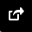
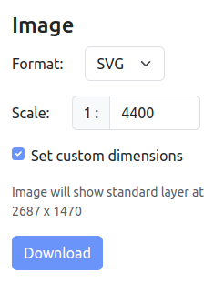
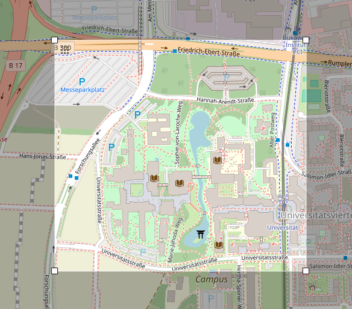

# OpenStreetMap map converter

- Go to <https://www.openstreetmap.org/>.
- Find the area you want to convert.
- Click on the "Share" button.

- Under `Image` set the `Format` to `SVG` and
- Set the `Scale` to `1:1`.
- OSM will not accept this scale, but will use the best lowest scale possible for your zoom factor.
- Activate `Set custom dimensions`

- Adapt the rectangular export area to your requirements.

- Save the used scale of the exported area. I prefer to use the scale as a suffix for the svg file name.

Have a look at <examples/ex08_convert_maps.py> on how to extract the buildings and save the newly generated, rescaled map as svg file.
