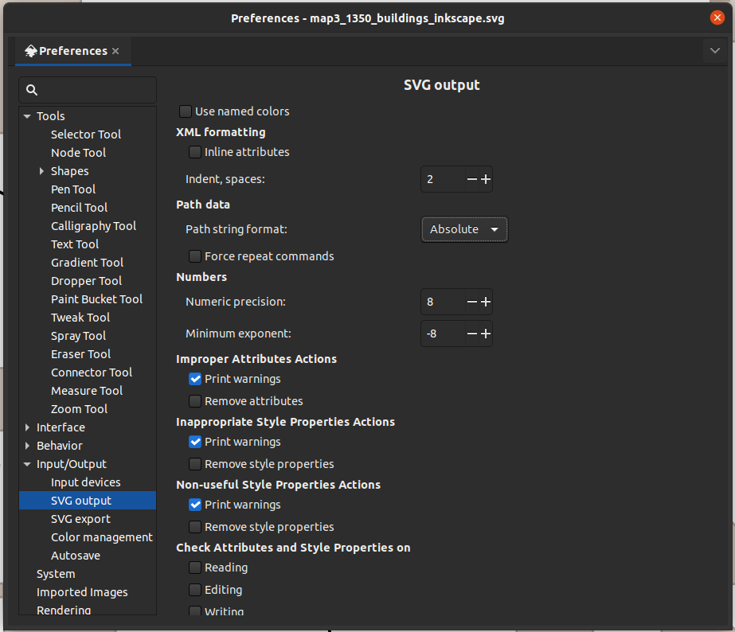
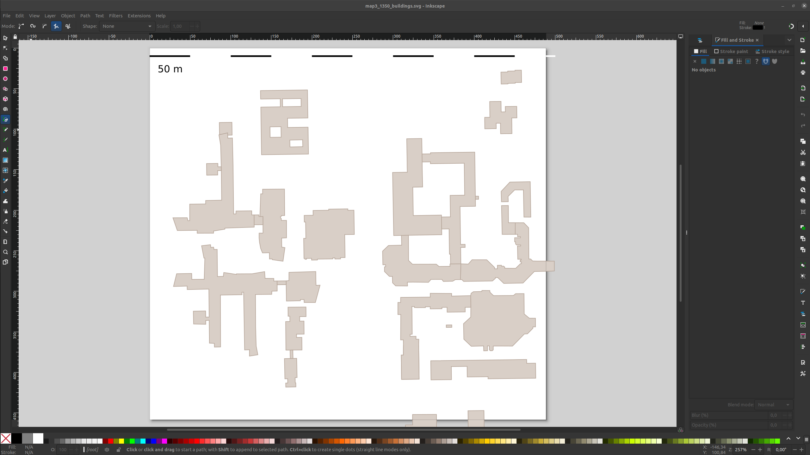
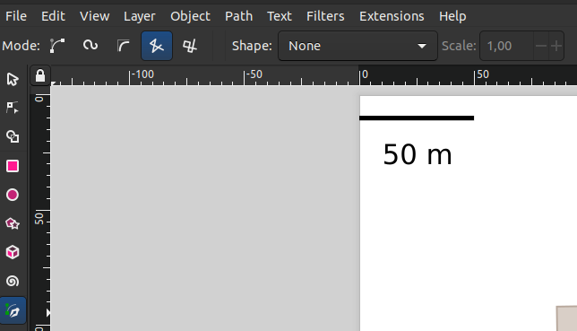
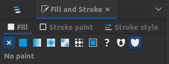
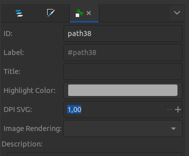

# Add pedestrian routes to the OSM SVG

## Requirements

Requirements: Use [OSM Map Converter](OSM_map_converter.md) to convert the OSM map to an SVG file.

## Inkscape

> !!! Inkscape Setup !!!

Based on [a forum contribution](<https://alpha.inkscape.org/vectors/www.inkscapeforum.com/viewtopic388d.html?t=11228>) it is necessary to change the desired path `Path data > Path string format:` from `Optimized` to `Absolute`!

The SVG file can be edited with Inkscape. The pedestrian routes can be added as lines to the svg file. The following example shows how to add pedestrian routes to the SVG file.

Open the converted svg file in Inkscape.

Use thh `Pen` tool in the Mode `Create a sequence of straight lines` to add the pedestrian routes.

Start with left clicks and finish with a right click.

Sometimes it is necessary to remove the fill color of the line.

## Label Pedestrian Routes

Each element in inkscape is differentiate by its label in `pysocialforce`.
You need to find the `Object Properties` tab. `Ctrl+Shift+O` is the shortcut to open the `Object Properties` tab. It can also be found in the right click context menu.
There, you have to edit the `Label:` field to `route`.

> !!! Remember to always `Set` the object level after editing at the bottom of the `Object Properties` tab !!!

An example map can be found here: <maps/osm_maps/converted_maps/map3_1350_buildings_inkscape.svg>.

Save the svg file.

## Use svg files as map layout

Use <pysocialforce/map_loader_svg.py> to handle the labeled svg files.

An example can be found in <examples/ex09_inkscape_svg_map.py>.
