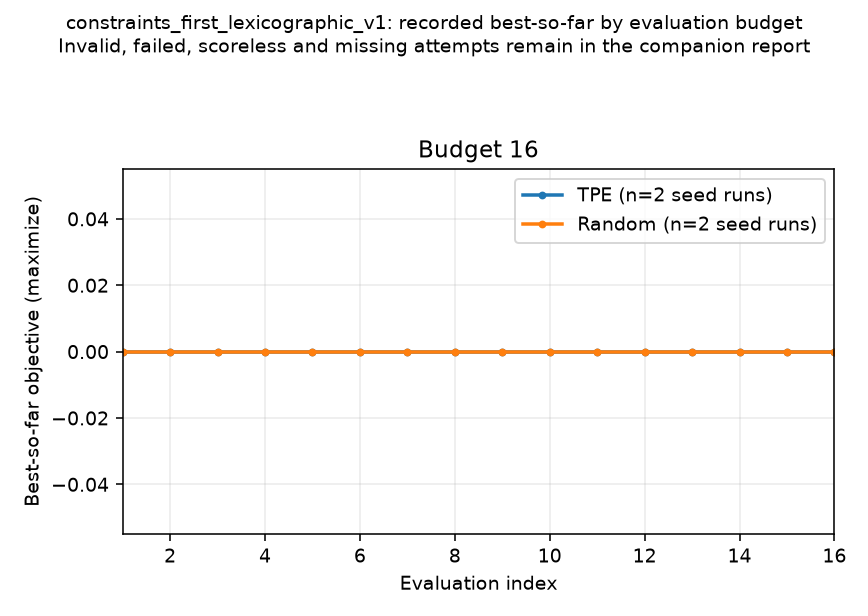

# Falsification search convergence report

This diagnostic report summarizes persisted search attempts and their best-so-far objective by evaluation budget.

- Claim scope: `diagnostic_only_finite_search_budget`.
- Comparison input SHA-256: `7c8e7d0f6c74cef38bc776d24d19737176eb9eaebcac99ff1a91faeda302e02d`.
- Source revision status: `consistent`.
- Exact source revision: `58e516aa4f69ff3098bf518199f483006589758c`.

## Per-run accounting

| Objective | Method | Seed | Budget | Best objective | First critical eval | Critical | Valid / invalid / failed / scoreless / missing | Duplicates | Execution modes | Availability | Runtime (s) | Artifact |
|---|---:|---:|---:|---:|---:|---:|---:|---:|---|---|---:|---|
| `constraints_first_lexicographic_v1` | Random | 1101 | 16 | 0 | None found | 0 | 16 / 0 / 0 / 0 / 0 | 0/16 | native: 16 | available: 16 | Not recorded | available |
| `constraints_first_lexicographic_v1` | TPE | 1101 | 16 | 0 | None found | 0 | 16 / 0 / 0 / 0 / 0 | 0/16 | native: 16 | available: 16 | Not recorded | available |
| `constraints_first_lexicographic_v1` | Random | 2202 | 16 | 0 | None found | 0 | 16 / 0 / 0 / 0 / 0 | 0/16 | native: 16 | available: 16 | Not recorded | available |
| `constraints_first_lexicographic_v1` | TPE | 2202 | 16 | 0 | None found | 0 | 16 / 0 / 0 / 0 / 0 | 0/16 | native: 16 | available: 16 | Not recorded | available |

Valid candidates are derived as `candidate rows - invalid - failed`; scoreless valid candidates remain in the valid count.

Invalid, failed, scoreless and missing evaluation attempts remain explicit and are not dropped from candidate accounting.

## Matched Random vs TPE

| Objective | Budget | Matched seeds | TPE − Random median | Observed delta range | Inference |
|---|---:|---:|---:|---:|---|
| `constraints_first_lexicographic_v1` | 16 | 2 | 0 | 0 to 0 | Not performed; descriptive only |

## Figures

## Interpretation limits

- A finite search budget that finds no counterexample does not establish that none exists.
- Seed/run aggregates are descriptive; observed min/max ranges are not confidence intervals.
- No inferential test is performed, and small pilot seed counts do not support broad claims.
- Search-level runtime remains unknown unless explicitly recorded in the comparison row or search manifest.
- The current runner's legacy num_valid_candidates summary omits evaluator failures; this report derives valid as candidate rows minus invalid minus failed and retains the legacy field for audit.
- A report built from fixtures demonstrates report behavior, not planner safety or empirical search performance.

## Provenance

Comparison artifact: `output/issue9645-pilot/comparison.json`.

- `random:1101:16:constraints_first_lexicographic_v1:row1`: `output/issue9645-pilot/results/constraints_first_lexicographic_v1/budget_0016/seed_1101/random/manifest.json`; SHA-256 `fad937010131d1d12ed97260966383f9c19a41cceefe099f2d76a2c2cce17c13`; config SHA-256 `f174f22672aa05d222f7ce6bb20ecf64a042fb73dca9449dbaf7c44dc3e4ec38`; status `available`.
- `optuna:1101:16:constraints_first_lexicographic_v1:row2`: `output/issue9645-pilot/results/constraints_first_lexicographic_v1/budget_0016/seed_1101/optuna/manifest.json`; SHA-256 `00244a3d158079ef36de6e301fa6348b50d879a4a6f48492389776b8b411e9a0`; config SHA-256 `a3e0978a698fa7d3696c101203b39a15702447906249e46f77d80ca2c7b9e6ea`; status `available`.
- `random:2202:16:constraints_first_lexicographic_v1:row3`: `output/issue9645-pilot/results/constraints_first_lexicographic_v1/budget_0016/seed_2202/random/manifest.json`; SHA-256 `d15846cae0423334604b39efa65a15ec8842622edb992b397bf29f973a71fd0c`; config SHA-256 `84de14ba637674502970acd646e915dcc27b85ce454a897beb540af6e8e44162`; status `available`.
- `optuna:2202:16:constraints_first_lexicographic_v1:row4`: `output/issue9645-pilot/results/constraints_first_lexicographic_v1/budget_0016/seed_2202/optuna/manifest.json`; SHA-256 `1ace494078f174c1e9cd454ca97c60e2408343e192bc2c3d4f1408128917b00b`; config SHA-256 `7d91ed1a1a7c319bcba735813152b19ab1b202d018b7b4322fbe9e2261663e75`; status `available`.
